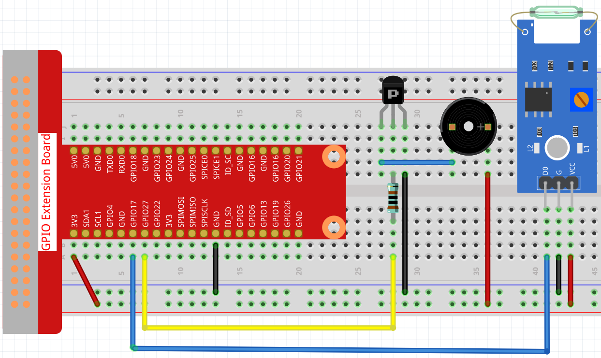
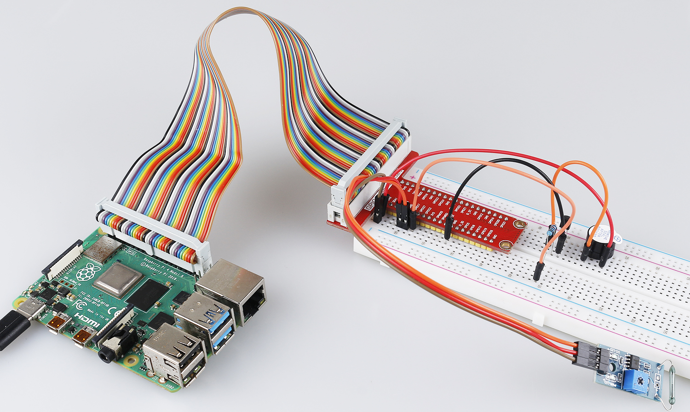

4.1.6 Magnetic Induction Alarm System
============================================

Introduction
-----------------

When you get a precious vase, you can make a magnetic induction alarm system for it, no matter who moves it, you can hear the alarm in time.

Components
----------------

.. image:: ../img/3.1.20components.png
  :width: 800
  :align: center

* :ref:`GPIO Extension Board`
* :ref:`Breadboard`
* :ref:`Resistor`
* :ref:`Buzzer`
* :ref:`Transistor`
* :ref:`Reed Switch Module`

Schematic Diagram
-----------------------

============ ======== ======== ===
T-Board Name physical wiringPi BCM
GPIO17       Pin 11   0        17
GPIO27       Pin 13   2        27
============ ======== ======== ===

.. image:: ../img/3.1.20_schematic.png
   :width: 600
   :align: center

Experimental Procedures
------------------------------

**Step 1:** Build the circuit.

**Step 2:** Get into the folder of the code.

.. raw:: html

   <run></run>

.. code-block::

    cd /home/pi/raphael-kit/python/

**Step 3:** Run.

.. raw:: html

   <run></run>

.. code-block::

    sudo python3 4.1.6_MagneticAlarmSystem.py

If the reed switch is affected by the magnet (for example, the reed switch is placed on the base and the magnet is placed in the vase), the object is safe. At this time, the reed switch is in the closed state, and the buzzer is silent.
After removing the magnet (such as the vase being stolen), the reed switch is not affected by the magnetic, the switch opens, and the buzzer sounds an alarm.

**Code**

.. note::
    You can **Modify/Reset/Copy/Run/Stop** the code below. But before that, you need to go to  source code path like ``raphael-kit/python``. After modifying the code, you can run it directly to see the effect.

.. raw:: html

    <run></run>

.. code-block:: python

    #!/usr/bin/env python3
    import RPi.GPIO as GPIO
    import time

    BeepPin = 17
    ReedPin = 18

    def setup():
        GPIO.setmode(GPIO.BCM)
        GPIO.setup(BeepPin, GPIO.OUT, initial=GPIO.HIGH)
        GPIO.setup(ReedPin, GPIO.IN, pull_up_down=GPIO.PUD_UP)

    def loop():
        while True:
            if GPIO.input(ReedPin) == 0:
                GPIO.output(BeepPin, GPIO.HIGH)	
            else:
                GPIO.output(BeepPin, GPIO.LOW)
                time.sleep(0.1)
                GPIO.output(BeepPin, GPIO.HIGH)
                time.sleep(0.1)

    def destroy():
        GPIO.output(BeepPin, GPIO.HIGH)
        GPIO.cleanup()

    if __name__ == '__main__':
        setup()
        try:
            loop()
        except KeyboardInterrupt:
            destroy()

**Code Explanation**

.. code-block:: python

    def loop():
        while True:
            if GPIO.input(ReedPin) == 0:
                GPIO.output(BeepPin, GPIO.HIGH)
            else:
                GPIO.output(BeepPin, GPIO.LOW)
                time.sleep(0.1)
                GPIO.output(BeepPin, GPIO.HIGH)
                time.sleep(0.1)

We judge the state of the reed switch in the main loop. If the reed switch is closed, the buzzer does not work; otherwise, the buzzer beeps.

Phenomenon Picture
------------------------

