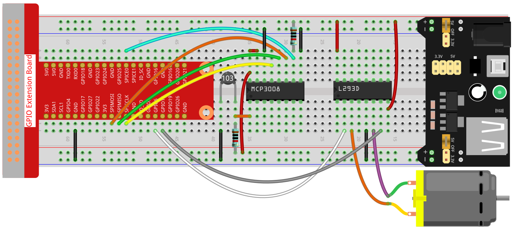

.. note::

    Ciao, benvenuto nella Community Facebook di appassionati di SunFounder Raspberry Pi & Arduino & ESP32! Approfondisci Raspberry Pi, Arduino ed ESP32 con altri appassionati.

    **Perché unirsi?**

    - **Supporto esperto**: Risolvi problemi post-vendita e sfide tecniche con l'aiuto della nostra community e del nostro team.
    - **Impara e condividi**: Scambia suggerimenti e tutorial per migliorare le tue competenze.
    - **Anteprime esclusive**: Ottieni l'accesso anticipato agli annunci di nuovi prodotti e alle anteprime.
    - **Sconti speciali**: Goditi sconti esclusivi sui nostri prodotti più recenti.
    - **Promozioni festive e giveaway**: Partecipa a giveaway e promozioni festive.

    👉 Pronto a esplorare e creare con noi? Clicca [|link_sf_facebook|] e unisciti oggi stesso!

.. _blynk_motor2_py_mcp3008:

Ventola intelligente (MCP3008)
==============================

In questo progetto, puoi visualizzare la temperatura su Blynk e accendere la ventola da remoto.

.. note:: Prima di iniziare questo progetto, ti consigliamo di completare :ref:`bk_start_py`. La seguente sezione ti darà una chiara comprensione di Blynk.

**Componenti richiesti**

In questo progetto, ci servono i seguenti componenti.

È sicuramente conveniente acquistare un kit completo, ecco il link: 

.. list-table::
    :widths: 20 20 20
    :header-rows: 1

    *   - Nome	
        - ARTICOLI IN QUESTO KIT
        - LINK
    *   - Raphael Kit
        - 337
        - |link_Raphael_kit|

Puoi anche acquistarli separatamente dai link sottostanti.

.. list-table::
    :widths: 30 20
    :header-rows: 1

    *   - INTRODUZIONE COMPONENTE
        - LINK DI ACQUISTO

    *   - :ref:`cpn_gpio_extension_board`
        - |link_gpio_board_buy|
    *   - :ref:`cpn_breadboard`
        - |link_breadboard_buy|
    *   - :ref:`cpn_wires`
        - |link_wires_buy|
    *   - :ref:`cpn_resistor`
        - |link_resistor_buy|
    *   - :ref:`cpn_power_module`
        - \-
    *   - :ref:`cpn_l293d`
        - \-
    *   - :ref:`cpn_mcp3008`
        - \-
    *   - :ref:`cpn_thermistor`
        - |link_thermistor_buy|
    *   - :ref:`cpn_motor`
        - |link_motor_buy|

**1. Cablaggio**

**2. Creazione Widget e Datastream**

1. Clicca sull'icona del menu in alto a destra e seleziona *modifica dashboard*.

    .. image:: img/sp220913_180231.png

2. Aggiungi un widget Switch e un widget Label alla Dashboard.

    .. image:: img/sp220914_175437.png

3. Crea un Datastream (in questo esempio V3) per il widget Switch. Verrà utilizzato per accendere il motore.

    .. image:: img/sp220914_155911.png

4. Crea un Datastream per il widget Label (in questo esempio V0). Verrà utilizzato per visualizzare la temperatura. Imposta **DATA TYPE** su String.

    .. image:: img/sp220914_175616.png

#. Quando hai terminato, clicca su *Save And Apply* in alto a destra.

    .. image:: img/sp220913_182300.png

**3. Esegui il codice**

1. Modifica il codice

.. raw:: html

   <run></run>

.. code-block:: 

    cd ~/blynk-raspberrypi-python
    sudo nano blynk_motor(mcp3008).py

2. Trova la riga sottostante e incolla il tuo ``BLYNK_AUTH_TOKEN``.

.. code-block:: python

    BLYNK_AUTH = 'YourAuthToken'

3. Esegui il codice.

.. raw:: html

   <run></run>

.. code-block:: 

    sudo python3 blynk_motor(mcp3008).py

4. Vai su Blynk, nella Dashboard puoi controllare la temperatura tramite il widget Label; puoi accendere/spegnere la ventola tramite il widget Switch.

#. Se desideri utilizzare Blynk su dispositivi mobili, fai riferimento a :ref:`blynk_mobile`.
