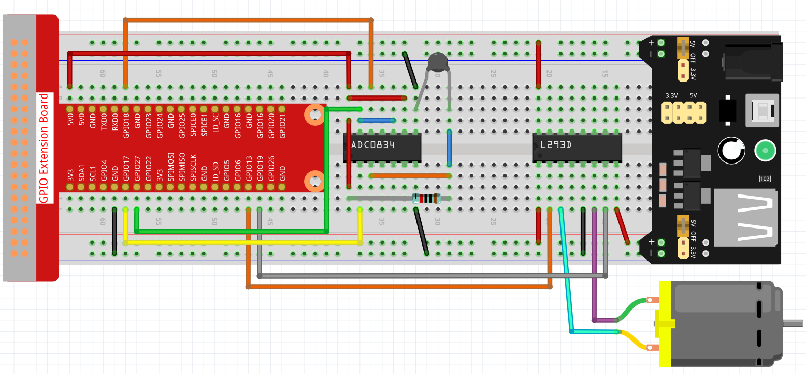

.. note::

    Hola, ¡bienvenido a la Comunidad de Entusiastas de SunFounder Raspberry Pi, Arduino y ESP32 en Facebook! Profundiza en Raspberry Pi, Arduino y ESP32 con otros entusiastas.

    **¿Por qué unirse?**

    - **Soporte experto**: Resuelve problemas post-venta y desafíos técnicos con la ayuda de nuestra comunidad y equipo.
    - **Aprende y comparte**: Intercambia consejos y tutoriales para mejorar tus habilidades.
    - **Avances exclusivos**: Obtén acceso anticipado a nuevos anuncios de productos y adelantos.
    - **Descuentos especiales**: Disfruta de descuentos exclusivos en nuestros productos más nuevos.
    - **Promociones festivas y sorteos**: Participa en sorteos y promociones navideñas.

    👉 ¿Listo para explorar y crear con nosotros? Haz clic en [|link_sf_facebook|] y únete hoy mismo!

.. _blynk_motor_py:

Ventilador Inteligente
==========================

En este proyecto, puedes ver la temperatura desde Blynk y encender el ventilador de forma remota.

.. note:: Antes de comenzar este proyecto, recomendamos que completes :ref:`bk_start_py`. Lo siguiente te dará una comprensión clara de Blynk.

**Componentes necesarios**

En este proyecto, necesitamos los siguientes componentes.

Es definitivamente conveniente comprar un kit completo, aquí está el enlace:

.. list-table::
    :widths: 20 20 20
    :header-rows: 1

    *   - Nombre	
        - ELEMENTOS EN ESTE KIT
        - ENLACE
    *   - Kit Raphael
        - 337
        - |link_Raphael_kit|

También puedes comprarlos por separado desde los enlaces a continuación.

.. list-table::
    :widths: 30 20
    :header-rows: 1

    *   - INTRODUCCIÓN DE COMPONENTES
        - ENLACE DE COMPRA

    *   - :ref:`cpn_gpio_extension_board`
        - |link_gpio_board_buy|
    *   - :ref:`cpn_breadboard`
        - |link_breadboard_buy|
    *   - :ref:`cpn_wires`
        - |link_wires_buy|
    *   - :ref:`cpn_resistor`
        - |link_resistor_buy|
    *   - :ref:`cpn_power_module`
        - \-
    *   - :ref:`cpn_l293d`
        - \-
    *   - :ref:`cpn_adc0834`
        - \-
    *   - :ref:`cpn_thermistor`
        - |link_thermistor_buy|
    *   - :ref:`cpn_motor`
        - |link_motor_buy|

**1. Conexión**

**2. Crear Widget y Flujo de Datos**

1. Haz clic en el ícono del menú en la esquina superior derecha y selecciona editar tablero.

    .. image:: img/sp220913_180231.png

2. Agrega un widget de Interruptor y un widget de Etiqueta al Tablero.

    .. image:: img/sp220914_175437.png

3. Crea un flujo de datos (utilicé V3) para el widget de Interruptor. Se utilizará para encender el motor.

    .. image:: img/sp220914_155911.png

4. Crea un flujo de datos para el widget de Etiqueta (utilicé V0). Se utilizará para mostrar la temperatura. Configura **TIPO DE DATO** a Cadena.

    .. image:: img/sp220914_175616.png

#. Cuando termines, haz clic en Guardar y Aplicar en la parte superior derecha.

    .. image:: img/sp220913_182300.png

**3. Ejecutar el Código**

1. Edita el código

.. raw:: html

   <run></run>

.. code-block:: 

    cd ~/blynk-raspberrypi-python
    sudo nano blynk_motor.py

2. Encuentra la línea siguiente y pega tu ``BLYNK_AUTH_TOKEN``.

.. code-block:: python

    BLYNK_AUTH = 'YourAuthToken'

3. Ejecuta el código.

.. raw:: html

   <run></run>

.. code-block:: 

    sudo python3 blynk_motor.py

4. Ve a Blynk, en el Tablero puedes ver la temperatura a través del widget de Etiqueta; puedes encender/apagar el ventilador a través del widget de Interruptor.

#. Si deseas usar Blynk en dispositivos móviles, consulta :ref:`blynk_mobile`.
