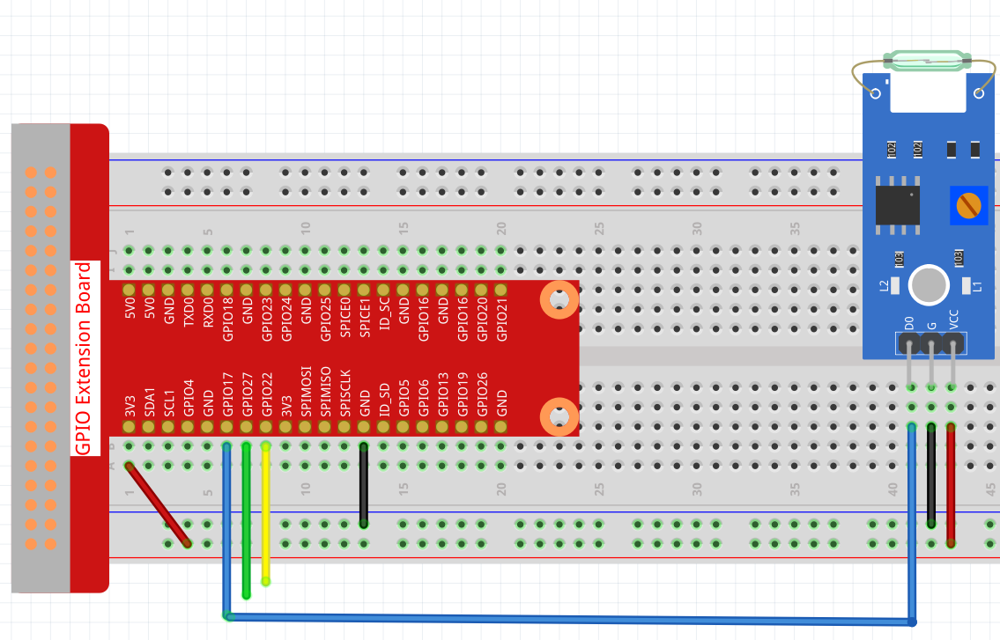

Door Window Sensor
==================

When you're outside, you've probably had this confusion. "Are the doors and windows of my house closed?"

To solve this problem, in this project, we will build a door and window sensor with Reed Switch and magnets.

Install this sensor and magnet on both sides of the door or window. You will be able to check whether your doors and windows are closed or not from the Blynk APP on your phone.

.. note:: Before starting this project, we recommend that you complete :ref:`bk_start`. The following will give you a clear understanding of Blynk.

**1. Wiring**

**2. Create Datastream**

1. Click on the menu icon in the upper right corner and select edit dashboard.

    .. image:: img/sp220913_180231.png

2. Go to the Datastreams page and create a New Datastream.

    .. image:: img/sp220914_165911.png

3. Create a Virtual Pin V4.

    .. image:: img/sp220914_170113.png

#. When finished, click Save And Apply at the top right.

    .. image:: img/sp220913_182300.png

**3. Run the Code**

1. Edit the code

.. raw:: html

   <run></run>

.. code-block:: 

    cd /home/pi/blynk-raspberrypi-python
    sudo nano blynk_reed.py

2. Find the line below and past your ``BLYNK_AUTH_TOKEN``.

.. code-block:: python

    BLYNK_AUTH = 'YourAuthToken'

3. Run the code.

.. raw:: html

   <run></run>

.. code-block:: 

    sudo python3 blynk_reed.py

**4. Open Blynk APP**

.. note::

    As datastreams can only be created in Blynk on the web, you will need to reference different projects to create datastreams on the web, then follow the tutorial below to create widgets in Blynk on your mobile device.

#. Open Google Play or APP Store on your mobile device and search for "Blynk IoT" (not Blynk(legacy)) to download.
#. After opening the APP, login in, this account should be the same as the account used on the web client.
#. Then go to **Dashboard** (if you don't have one, create one) and you will see that the **Dashboard** for mobile and web are independent of each other.

    .. image:: img/APP_1.jpg

#. Click **Edit** Icon.
#. Click on the blank area. 
#. Choose **LED** widget.

    .. image:: img/APP_2.jpg      

#. Now you will see a **LED** widget appear in the blank area, even if it looks like a blank grid, click on it.
#. **LED** Settings will appear, select the **V4** datastreams you just set in the web page. Note that each widget corresponds to a different datastream in each project.
#. Go back to the **Dashboard** page. Now if you see that the **LED** widget is filled with color, your door or window is open; if the **LED** widget is not filled with color, the door or window is closed.

    .. image:: img/APP_3.jpg

