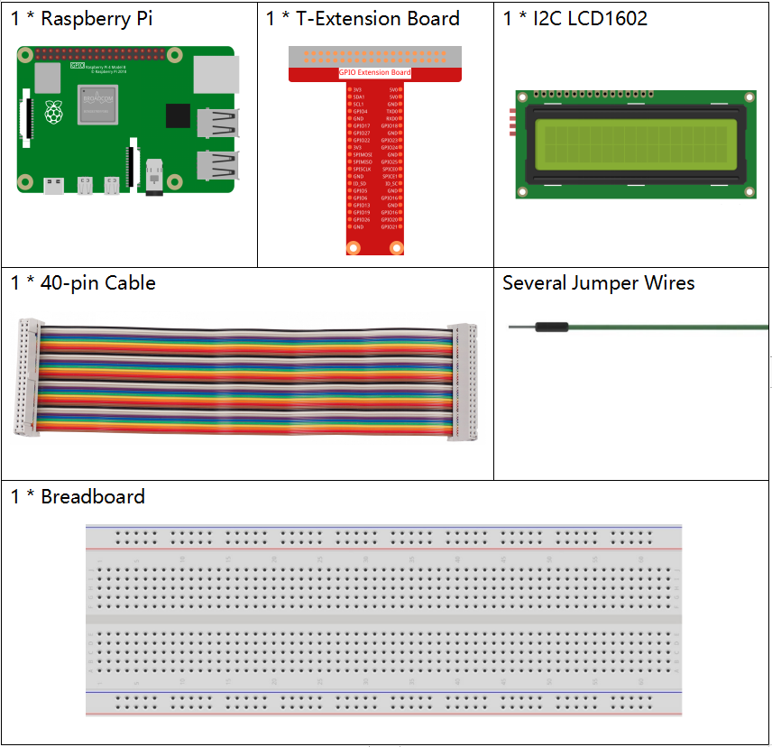

.. note::

    Hallo und willkommen in der SunFounder Raspberry Pi & Arduino & ESP32 Enthusiasten-Gemeinschaft auf Facebook! Tauchen Sie tiefer ein in die Welt von Raspberry Pi, Arduino und ESP32 mit anderen Enthusiasten.

    **Warum beitreten?**

    - **Expertenunterstützung**: Lösen Sie Nachverkaufsprobleme und technische Herausforderungen mit Hilfe unserer Gemeinschaft und unseres Teams.
    - **Lernen & Teilen**: Tauschen Sie Tipps und Anleitungen aus, um Ihre Fähigkeiten zu verbessern.
    - **Exklusive Vorschauen**: Erhalten Sie frühzeitigen Zugang zu neuen Produktankündigungen und exklusiven Einblicken.
    - **Spezialrabatte**: Genießen Sie exklusive Rabatte auf unsere neuesten Produkte.
    - **Festliche Aktionen und Gewinnspiele**: Nehmen Sie an Gewinnspielen und Feiertagsaktionen teil.

    👉 Sind Sie bereit, mit uns zu erkunden und zu erschaffen? Klicken Sie auf [|link_sf_facebook|] und treten Sie heute bei!

.. _1.1.7_py_pi5:

1.1.6 I2C LCD1602
======================

Einführung
------------------

Das LCD1602 ist ein Zeichen-basiertes Flüssigkristalldisplay, das gleichzeitig 32
(16*2) Zeichen anzeigen kann.

Benötigte Komponenten
------------------------------

Für dieses Projekt benötigen wir die folgenden Komponenten.

Es ist definitiv praktisch, ein ganzes Kit zu kaufen, hier ist der Link:

.. list-table::
    :widths: 20 20 20
    :header-rows: 1

    *   - Name	
        - INHALT DES KITS
        - LINK
    *   - Raphael Kit
        - 337
        - |link_Raphael_kit|

Sie können sie auch separat über die untenstehenden Links kaufen.

.. list-table::
    :widths: 30 20
    :header-rows: 1

    *   - KOMPONENTENVORSTELLUNG
        - KAUF-LINK

    *   - :ref:`cpn_gpio_board`
        - |link_gpio_board_buy|
    *   - :ref:`cpn_breadboard`
        - |link_breadboard_buy|
    *   - :ref:`cpn_wires`
        - |link_wires_buy|
    *   - :ref:`cpn_resistor`
        - |link_resistor_buy|
    *   - :ref:`cpn_i2c_lcd1602`
        - |link_i2clcd1602_buy|

Schaltplan
---------------------

============ ========
T-Board Name physical
SDA1         Pin 3
SCL1         Pin 5
============ ========

.. image:: ../python_pi5/img/1.1.7_i2c_lcd_schematic.png

Experimentelle Verfahren
-----------------------------

**Schritt 1:** Baue den Schaltkreis.

.. image:: ../python_pi5/img/1.1.7_i2c_lcd1602_circuit.png

**Schritt 2**: Richten Sie I2C ein (siehe :ref:`i2c_config`. Wenn Sie I2C bereits eingerichtet haben, überspringen Sie diesen Schritt.)

**Schritt 3:** Wechseln Sie das Verzeichnis.

.. raw:: html

   <run></run>

.. code-block::

    cd ~/raphael-kit/python-pi5

**Schritt 4:** Ausführen.

.. raw:: html

   <run></run>

.. code-block::

    sudo python3 1.1.7_Lcd1602_zero.py

Nachdem der Code ausgeführt wurde, können Sie sehen, dass auf dem LCD „Greetings!, From SunFounder“ angezeigt wird.

.. note::

    * Wenn der Fehler „FileNotFoundError: [Errno 2] No such file or directory: '/dev/i2c-1'“ auftritt, müssen Sie :ref:`i2c_config` konsultieren, um I2C zu aktivieren.
    * Wenn der Fehler „ModuleNotFoundError: No module named 'smbus2'“ erscheint, führen Sie bitte „sudo pip3 install smbus2“ aus.
    * Wenn der Fehler „OSError: [Errno 121] Remote I/O error“ erscheint, bedeutet dies, dass das Modul falsch verdrahtet ist oder das Modul defekt ist.
    * Wenn der Code und die Verdrahtung korrekt sind, das LCD aber immer noch keinen Inhalt anzeigt, können Sie das Potentiometer auf der Rückseite drehen, um den Kontrast zu erhöhen.

**Code**

.. note::

    Sie können den untenstehenden Code **modifizieren/zurücksetzen/kopieren/ausführen/stoppen**. Aber zuvor müssen Sie zum Quellcodepfad wie „raphael-kit/python-pi5“ gehen. Nachdem Sie den Code modifiziert haben, können Sie ihn direkt ausführen, um den Effekt zu sehen.

.. raw:: html

    <run></run>

.. code-block:: python

   #!/usr/bin/env python3
   import LCD1602  # Import module for interfacing with LCD1602
   import time     # Import module for timing functions

   def setup():
       # Initialize LCD with I2C address 0x27 and enable backlight
       LCD1602.init(0x27, 1) 
       # Display the message 'Greetings!' at the top-left corner (row 0, column 0)
       LCD1602.write(0, 0, 'Greetings!') 
       # Display the message 'From SunFounder' on the second line (row 1, column 1)
       LCD1602.write(1, 1, 'From SunFounder') 
       time.sleep(2)  # Display messages for 2 seconds

   try:
       setup()  # Run the setup function to initialize the LCD and display messages
       
   except KeyboardInterrupt:
       # Clear the LCD display if a keyboard interruption (e.g., Ctrl+C) occurs
       LCD1602.clear()
       pass  # Proceed with no further action

**Code-Erklärung**

1. Diese Datei ist eine Open-Source-Datei zur Steuerung des I2C LCD1602. Sie ermöglicht es uns, das I2C LCD1602 einfach zu verwenden.

   .. code-block:: python

       import LCD1602  # Import module for interfacing with LCD1602

2. Die Funktion initialisiert das I2C-System mit dem angegebenen Gerätesymbol. Der erste Parameter ist die Adresse des I2C-Geräts, die über den i2cdetect-Befehl ermittelt werden kann (siehe Anhang für Details). Die Adresse des I2C LCD1602 ist in der Regel 0x27.

   .. code-block:: python

       # Initialize LCD with I2C address 0x27 and enable backlight
       LCD1602.init(0x27, 1) 

3. „LCD1602.write“ wird verwendet, um Nachrichten auf dem LCD anzuzeigen. Die ersten beiden Parameter sind Zeilen- und Spaltenpositionen und der dritte ist die Nachricht. Nun können Sie „Greetings!! From SunFounder“ auf dem LCD angezeigt sehen.

   .. code-block:: python

       # Display the message 'Greetings!' at the top-left corner (row 0, column 0)
       LCD1602.write(0, 0, 'Greetings!') 
       # Display the message 'From SunFounder' on the second line (row 1, column 1)
       LCD1602.write(1, 1, 'From SunFounder') 

