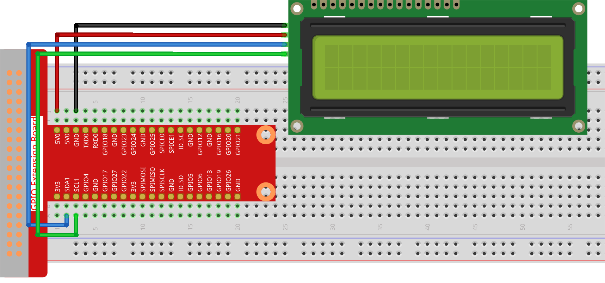

.. note::

    ¡Hola, bienvenido a la Comunidad de Entusiastas de SunFounder Raspberry Pi & Arduino & ESP32 en Facebook! Sumérgete más en Raspberry Pi, Arduino y ESP32 con otros entusiastas.

    **¿Por qué unirse?**

    - **Soporte Experto**: Resuelve problemas postventa y desafíos técnicos con la ayuda de nuestra comunidad y equipo.
    - **Aprender y Compartir**: Intercambia consejos y tutoriales para mejorar tus habilidades.
    - **Previsualizaciones Exclusivas**: Obtén acceso anticipado a nuevos anuncios de productos y avances.
    - **Descuentos Especiales**: Disfruta de descuentos exclusivos en nuestros productos más recientes.
    - **Promociones Festivas y Sorteos**: Participa en sorteos y promociones de temporada.

    👉 ¿Listo para explorar y crear con nosotros? Haz clic en [|link_sf_facebook|] y únete hoy mismo!

.. _1.1.7_py_pi5:

1.1.7 I2C LCD1602
========================

Introducción
---------------------

LCD1602 es una pantalla de cristal líquido de tipo carácter, que puede mostrar 
32 (16*2) caracteres al mismo tiempo.

Componentes Necesarios
---------------------------------

En este proyecto, necesitamos los siguientes componentes.

.. image:: ../python_pi5/img/1.1.7_i2c_lcd_list.png

Es definitivamente conveniente comprar un kit completo, aquí está el enlace:

.. list-table::
    :widths: 20 20 20
    :header-rows: 1

    *   - Nombre
        - ARTÍCULOS EN ESTE KIT
        - ENLACE
    *   - Kit Raphael
        - 337
        - |link_Raphael_kit|

También puedes comprarlos por separado en los siguientes enlaces.

.. list-table::
    :widths: 30 20
    :header-rows: 1

    *   - INTRODUCCIÓN DE COMPONENTES
        - ENLACE DE COMPRA

    *   - :ref:`cpn_gpio_board`
        - |link_gpio_board_buy|
    *   - :ref:`cpn_breadboard`
        - |link_breadboard_buy|
    *   - :ref:`cpn_wires`
        - |link_wires_buy|
    *   - :ref:`cpn_i2c_lcd`
        - |link_i2clcd1602_buy|

Diagrama Esquemático
---------------------

============== ========
T-Board Nombre física
SDA1           Pin 3
SCL1           Pin 5
============== ========

.. image:: ../python_pi5/img/1.1.7_i2c_lcd_schematic.png

Procedimientos Experimentales
---------------------------------

**Paso 1:** Montar el circuito.

**Paso 2:** Configurar I2C (ver :ref:`i2c_config`. Si ya has configurado I2C, omite este paso.)

**Paso 3:** Cambiar de directorio.

.. raw:: html

   <run></run>

.. code-block::

    cd ~/raphael-kit/python-pi5

**Paso 4:** Ejecutar.

.. raw:: html

   <run></run>

.. code-block::

    sudo python3 1.1.7_Lcd1602_zero.py

Después de ejecutar el código, podrás ver ``Greetings!, From SunFounder`` en la pantalla LCD.

.. note::

    * Si obtienes el error ``FileNotFoundError: [Errno 2] No such file or directory: '/dev/i2c-1'``, necesitas consultar :ref:`i2c_config` para habilitar el I2C.
    * Si obtienes el error ``ModuleNotFoundError: No module named 'smbus2'``, por favor ejecuta ``sudo apt install python3-smbus2``.
    * Si aparece el error ``OSError: [Errno 121] Remote I/O error``, significa que el módulo está mal conectado o está dañado.
    * Si el código y el cableado están bien, pero la pantalla LCD aún no muestra contenido, puedes girar el potenciómetro en la parte posterior para aumentar el contraste.

.. warning::

    Si recibe el mensaje de error ``RuntimeError: Cannot determine SOC peripheral base address``, consulte :ref:`faq_soc`

**Código**

.. note::

    Puedes **Modificar/Restablecer/Copiar/Ejecutar/Detener** el código a continuación. Pero antes de eso, necesitas ir a la ruta del código fuente como ``raphael-kit/python-pi5``. Después de modificar el código, puedes ejecutarlo directamente para ver el efecto.

.. raw:: html

    <run></run>

.. code-block:: python

   #!/usr/bin/env python3
   import LCD1602  # Import module for interfacing with LCD1602
   import time     # Import module for timing functions

   def setup():
       # Initialize LCD with I2C address 0x27 and enable backlight
       LCD1602.init(0x27, 1) 
       # Display the message 'Greetings!' at the top-left corner (row 0, column 0)
       LCD1602.write(0, 0, 'Greetings!') 
       # Display the message 'From SunFounder' on the second line (row 1, column 1)
       LCD1602.write(1, 1, 'From SunFounder') 
       time.sleep(2)  # Display messages for 2 seconds

   def destroy():
       LCD1602.clear()  # Clear the LCD display

   try:
       setup()  # Run the setup function to initialize the LCD and display messages

   except KeyboardInterrupt:
       pass  # Handle Ctrl+C gracefully

   finally:
       destroy()  # Ensure the LCD screen is cleared on exit

**Explicación del Código**

1. Este archivo es un archivo de código abierto para controlar el I2C LCD1602. Nos permite usar fácilmente el I2C LCD1602.

   .. code-block:: python

       import LCD1602  # Import module for interfacing with LCD1602

2. La función inicializa el sistema I2C con el símbolo del dispositivo designado. El primer parámetro es la dirección del dispositivo I2C, que se puede detectar a través del comando i2cdetect (ver Apéndice para más detalles). La dirección del I2C LCD1602 generalmente es 0x27.

   .. code-block:: python

       # Initialize LCD with I2C address 0x27 and enable backlight
       LCD1602.init(0x27, 1) 

3. ``LCD1602.write`` se usa para mostrar mensajes en la LCD. Los primeros dos parámetros son posiciones de fila y columna, y el tercero es el mensaje. Ahora puedes ver "Greetings! From SunFounder" mostrado en la LCD.

   .. code-block:: python

       # Display the message 'Greetings!' at the top-left corner (row 0, column 0)
       LCD1602.write(0, 0, 'Greetings!') 
       # Display the message 'From SunFounder' on the second line (row 1, column 1)
       LCD1602.write(1, 1, 'From SunFounder') 

