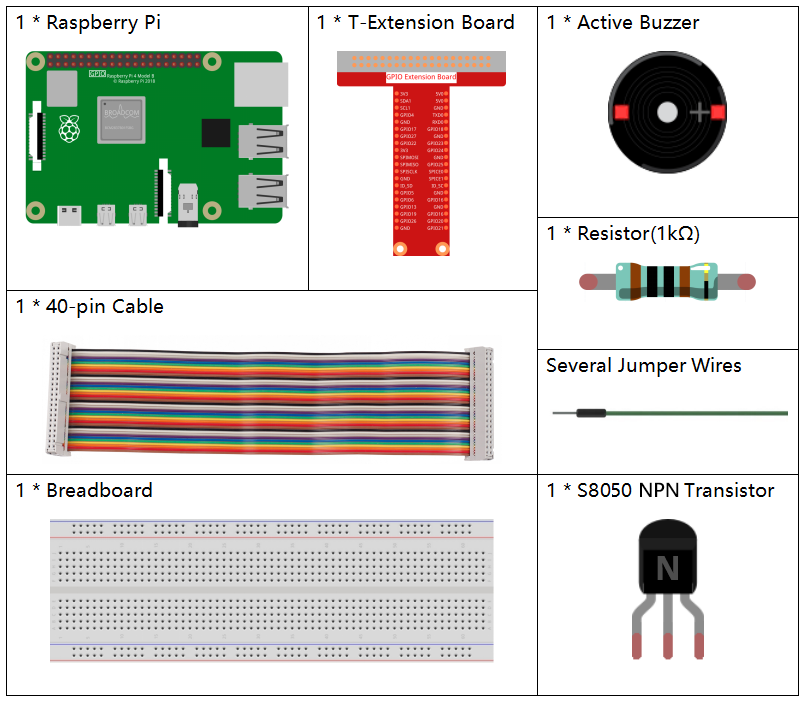

.. _1.2.1_py_pi5:

1.2.1 アクティブブザー
==================================

はじめに
------------

このプロジェクトでは、PNPトランジスタを使用してアクティブブザーを鳴らす方法を学びます。

必要な部品
------------------------------

このプロジェクトには、次のコンポーネントが必要です。 

一式を購入するのが便利です、こちらがリンクです： 

.. list-table::
    :widths: 20 20 20
    :header-rows: 1

    *   - 名前	
        - このキットのアイテム
        - リンク
    *   - Raphael Kit
        - 337
        - |link_Raphael_kit|

以下のリンクから別々に購入することもできます。

.. list-table::
    :widths: 30 20
    :header-rows: 1

    *   - コンポーネントの紹介
        - 購入リンク

    *   - :ref:`cpn_gpio_board`
        - |link_gpio_board_buy|
    *   - :ref:`cpn_breadboard`
        - |link_breadboard_buy|
    *   - :ref:`cpn_wires`
        - |link_wires_buy|
    *   - :ref:`cpn_resistor`
        - |link_resistor_buy|
    *   - :ref:`cpn_buzzer`
        - \-
    *   - :ref:`cpn_transistor`
        - |link_transistor_buy|

回路図
-----------------

この実験では、アクティブブザー、PNPトランジスタ、および1kΩの抵抗器が、トランジスタのベースとGPIOの間に使用されてトランジスタを保護します。 Raspberry PiのGPIO17の出力に高い電圧（3.3V）が供給されると、トランジスタは電流飽和のために導通し、ブザーは音を鳴らします。しかし、Raspberry PiのIOに低い電圧が供給されると、トランジスタは遮断され、ブザーは音を鳴らしません。

============ ======== ===
T-Board Name physical BCM
GPIO17       Pin 11   17
============ ======== ===

.. image:: ../python_pi5/img/1.2.1_active_buzzer_schematic.png

実験手順
-----------------------

**ステップ1:** 回路を組み立てます（アクティブブザーには表面に白いテーブルステッカーがあり、裏面は黒です）。

.. image:: ../python_pi5/img/1.2.1_ActiveBuzzer_circuit.png

**ステップ2**: コードファイルを開きます。

.. raw:: html

   <run></run>

.. code-block::

    cd ~/raphael-kit/python-pi5

**ステップ3**: 実行します。

.. raw:: html

   <run></run>

.. code-block::

    sudo python3 1.2.1_ActiveBuzzer_zero.py

コードを実行すると、ブザーが鳴ります。

**コード**

.. note::

    以下のコードは変更/リセット/コピー/実行/停止ができます。ただし、コードを変更する前に ``raphael-kit/python_5`` のようなソースコードのパスに移動する必要があります。コードを変更した後、直接実行して効果を確認できます。

.. raw:: html

    <run></run>

.. code-block:: python

   #!/usr/bin/env python3
   from gpiozero import Buzzer
   from time import sleep

   # Initialize a Buzzer object on GPIO pin 17
   buzzer = Buzzer(17)

   try:
       while True:
           # Turn on the buzzer
           print('Buzzer On')
           buzzer.on()
           sleep(0.1)  # Keep the buzzer on for 0.1 seconds

           # Turn off the buzzer
           print('Buzzer Off')
           buzzer.off()
           sleep(0.1)  # Keep the buzzer off for 0.1 seconds

   except KeyboardInterrupt:
       # Handle KeyboardInterrupt (Ctrl+C) for clean script termination
       pass

**コードの説明**

1. これらのステートメントは ``gpiozero`` ライブラリから ``Buzzer`` クラスと ``time`` モジュールから ``sleep`` 関数をインポートします。

   .. code-block:: python
       
       #!/usr/bin/env python3
       from gpiozero import Buzzer
       from time import sleep

2. この行は、Raspberry PiのGPIOピン17に接続された ``Buzzer`` オブジェクトを作成します。
    
   .. code-block:: python
       
       # Initialize a Buzzer object on GPIO pin 17
       buzzer = Buzzer(17)
        

3. 無限ループ（ ``while True`` ）内で、ブザーは0.1秒ごとにオンとオフになります。 ``print`` ステートメントは各アクションに対するコンソール出力を提供します。
      
   .. code-block:: python
       
       try:
           while True:
               # Turn on the buzzer
               print('Buzzer On')
               buzzer.on()
               sleep(0.1)  # Keep the buzzer on for 0.1 seconds

               # Turn off the buzzer
               print('Buzzer Off')
               buzzer.off()
               sleep(0.1)  # Keep the buzzer off for 0.1 seconds

4. このセグメントは、キーボード割り込み（Ctrl+C）を使用してプログラムを安全に終了できるようにします。
      
   .. code-block:: python
       
       except KeyboardInterrupt:
       # Handle KeyboardInterrupt (Ctrl+C) for clean script termination
       pass