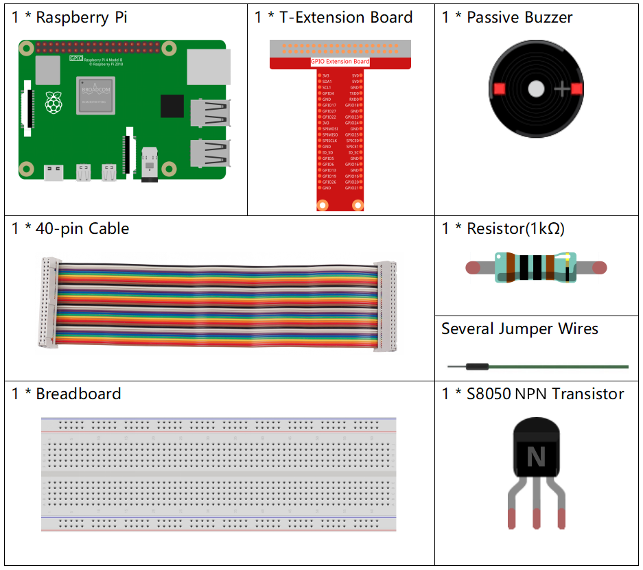
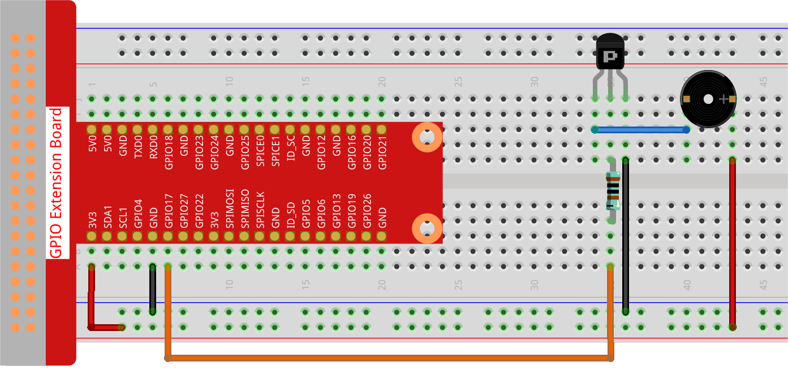

.. note::

    Ciao, benvenuto nella Community di SunFounder Raspberry Pi & Arduino & ESP32 Enthusiasts su Facebook! Approfondisci il mondo di Raspberry Pi, Arduino ed ESP32 insieme ad altri appassionati.

    **Perché unirti a noi?**

    - **Supporto tecnico esperto**: Risolvi problemi post-vendita e sfide tecniche con l'aiuto della nostra comunità e del nostro team.
    - **Impara e condividi**: Scambia consigli e tutorial per migliorare le tue competenze.
    - **Anteprime esclusive**: Ottieni accesso anticipato agli annunci di nuovi prodotti e alle anteprime.
    - **Sconti speciali**: Approfitta di sconti esclusivi sui nostri prodotti più recenti.
    - **Promozioni festive e giveaway**: Partecipa a giveaway e promozioni durante le festività.

    👉 Sei pronto a esplorare e creare con noi? Clicca [|link_sf_facebook|] e unisciti oggi stesso!

.. _1.2.2_py_pi5:

1.2.2 Buzzer Passivo
=====================

Introduzione
------------

In questo progetto, impareremo a far suonare un buzzer passivo per riprodurre musica.

Componenti Necessari
------------------------------

Per questo progetto, avremo bisogno dei seguenti componenti.

È decisamente conveniente acquistare un kit completo, ecco il link:

.. list-table::
    :widths: 20 20 20
    :header-rows: 1

    *   - Nome	
        - COMPONENTI NEL KIT
        - LINK
    *   - Raphael Kit
        - 337
        - |link_Raphael_kit|

Puoi anche acquistarli separatamente dai link sottostanti.

.. list-table::
    :widths: 30 20
    :header-rows: 1

    *   - INTRODUZIONE AI COMPONENTI
        - LINK D'ACQUISTO

    *   - :ref:`cpn_gpio_extension_board`
        - |link_gpio_board_buy|
    *   - :ref:`cpn_breadboard`
        - |link_breadboard_buy|
    *   - :ref:`cpn_wires`
        - |link_wires_buy|
    *   - :ref:`cpn_resistor`
        - |link_resistor_buy|
    *   - :ref:`cpn_buzzer`
        - |link_passive_buzzer_buy|
    *   - :ref:`cpn_transistor`
        - |link_transistor_buy|

Schema Elettrico
---------------------

In questo esperimento, utilizziamo un buzzer passivo, un transistor PNP e una 
resistenza da 1k tra la base del transistor e il GPIO per proteggere il transistor.

Quando al GPIO17 vengono assegnate diverse frequenze, il buzzer passivo emetterà 
suoni differenti; in questo modo, il buzzer riprodurrà musica.

============ ======== ======== ===
T-Board Name physical wiringPi BCM
GPIO17       Pin 11   0        17
============ ======== ======== ===

.. image:: ../python_pi5/img/1.2.2_passive_buzzer_schematic.png

Procedure Sperimentali
---------------------------

**Passo 1:** Costruisci il circuito. (Il buzzer passivo ha una scheda circuito verde sul retro.)

**Passo 2: Cambia la directory.**

.. raw:: html

   <run></run>

.. code-block::

    cd ~/raphael-kit/python-pi5

**Passo 3: Esegui.**

.. raw:: html

   <run></run>

.. code-block::

    sudo python3 1.2.2_PassiveBuzzer_zero.py

Il codice viene eseguito e il buzzer riproduce un brano musicale.

<<<<<<< HEAD
**Codice**
=======

.. warning::

    If there is an error prompt  ``RuntimeError: Cannot determine SOC peripheral base address``, please refer to :ref:`faq_soc` 

**Code**
>>>>>>> 387505b31ef24b78d49967f4b4dcfb048c8f48cb

.. note::

    Puoi **Modificare/Resettare/Copiare/Eseguire/Fermare** il codice qui sotto. Ma prima, devi andare nella directory del codice come ``raphael-kit/python-pi5``. Dopo aver modificato il codice, puoi eseguirlo direttamente per vedere l'effetto.

.. raw:: html

    <run></run>

.. code-block:: python

   #!/usr/bin/env python3
   from gpiozero import TonalBuzzer
   from time import sleep

   # Inizializza un oggetto TonalBuzzer collegato al pin GPIO 17
   tb = TonalBuzzer(17)  # Aggiorna questo numero di pin in base alla tua configurazione

   def play(tune):
       """
       Play a musical tune using the buzzer.
       :param tune: List of tuples (note, duration), where each tuple represents a note and its duration.
       """
       for note, duration in tune:
           print(note)  # Visualizza la nota corrente in riproduzione
           tb.play(note)  # Riproduce la nota sul buzzer
           sleep(float(duration))  # Attendi per la durata della nota
       tb.stop()  # Ferma la riproduzione dopo la fine della melodia

   # Definisci una melodia come sequenza di note e durate
   tune = [('C#4', 0.2), ('D4', 0.2), (None, 0.2),
       ('Eb4', 0.2), ('E4', 0.2), (None, 0.6),
       ('F#4', 0.2), ('G4', 0.2), (None, 0.6),
       ('Eb4', 0.2), ('E4', 0.2), (None, 0.2),
       ('F#4', 0.2), ('G4', 0.2), (None, 0.2),
       ('C4', 0.2), ('B4', 0.2), (None, 0.2),
       ('F#4', 0.2), ('G4', 0.2), (None, 0.2),
       ('B4', 0.2), ('Bb4', 0.5), (None, 0.6),
       ('A4', 0.2), ('G4', 0.2), ('E4', 0.2), 
       ('D4', 0.2), ('E4', 0.2)]

   try:
       play(tune)  # Esegui la funzione play per avviare la riproduzione della melodia

   except KeyboardInterrupt:
       # Gestisce l'interruzione da tastiera per una chiusura pulita del programma
       pass

**Spiegazione del Codice**

#. Queste righe importano la classe ``TonalBuzzer`` dalla libreria ``gpiozero`` per il controllo del buzzer e la funzione ``sleep`` dal modulo ``time`` per creare ritardi.
    
   .. code-block:: python  

       #!/usr/bin/env python3
       from gpiozero import TonalBuzzer
       from time import sleep
      

#. Questa riga inizializza un oggetto ``TonalBuzzer`` sul pin GPIO 17.
    
   .. code-block:: python
       
       # Inizializza un TonalBuzzer collegato al pin GPIO 17
       tb = TonalBuzzer(17)  # Aggiorna questo numero di pin in base alla tua configurazione
      

#. La funzione ``play`` itera su una lista di tuple che rappresentano note musicali e le loro durate. Ogni nota viene riprodotta per la durata specificata, e il buzzer si ferma dopo aver completato la melodia.
    
   .. code-block:: python  

       def play(tune):
           """
           Play a musical tune using the buzzer.
           :param tune: List of tuples (note, duration), where each tuple represents a note and its duration.
           """
           for note, duration in tune:
               print(note)  # Visualizza la nota corrente in riproduzione
               tb.play(note)  # Riproduce la nota sul buzzer
               sleep(float(duration))  # Attendi per la durata della nota
           tb.stop()  # Ferma la riproduzione dopo la fine della melodia

#. La melodia viene definita come una sequenza di note (frequenze) e durate (secondi).
    
   .. code-block:: python

       # Definisci una melodia come sequenza di note e durate
       tune = [('C#4', 0.2), ('D4', 0.2), (None, 0.2),
           ('Eb4', 0.2), ('E4', 0.2), (None, 0.6),
           ('F#4', 0.2), ('G4', 0.2), (None, 0.6),
           ('Eb4', 0.2), ('E4', 0.2), (None, 0.2),
           ('F#4', 0.2), ('G4', 0.2), (None, 0.2),
           ('C4', 0.2), ('B4', 0.2), (None, 0.2),
           ('F#4', 0.2), ('G4', 0.2), (None, 0.2),
           ('B4', 0.2), ('Bb4', 0.5), (None, 0.6),
           ('A4', 0.2), ('G4', 0.2), ('E4', 0.2), 
           ('D4', 0.2), ('E4', 0.2)]  

#. La funzione ``play(tune)`` viene chiamata all'interno di un blocco ``try``. Un'``interruzione da tastiera`` (come Ctrl+C) fermerà il programma in modo pulito.
    
   .. code-block:: python  
       
       try:
           play(tune)  # Esegui la funzione play per avviare la riproduzione della melodia

       except KeyboardInterrupt:
           # Gestisce l'interruzione da tastiera per una chiusura pulita del programma
           pass
