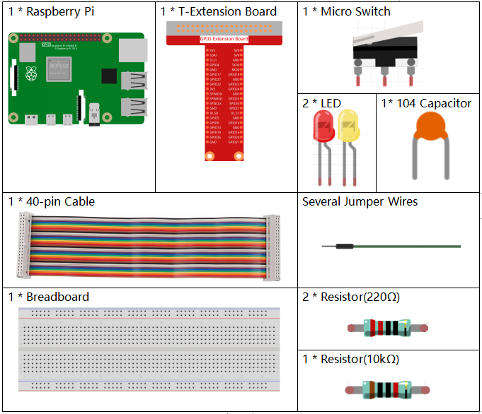
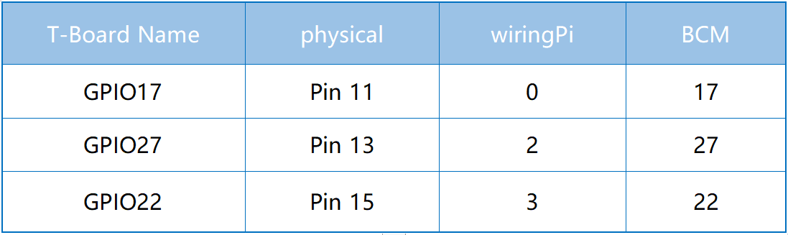
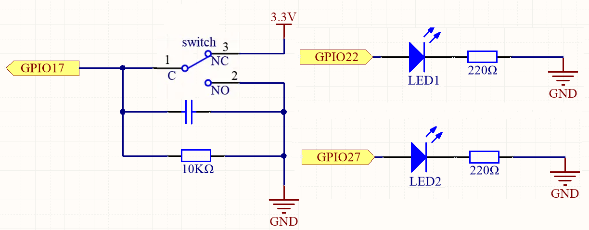
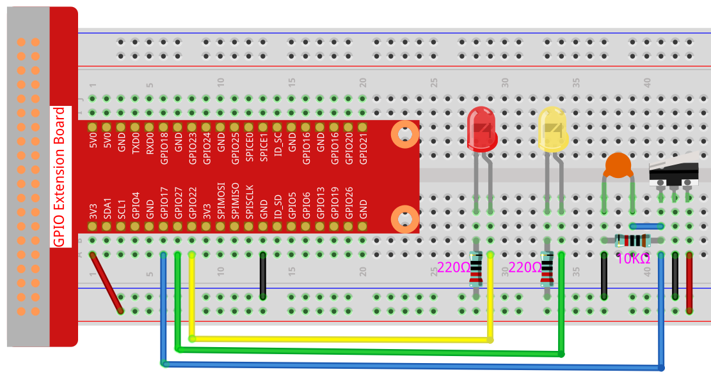

.. note::

    Hello, welcome to the SunFounder Raspberry Pi & Arduino & ESP32 Enthusiasts Community on Facebook! Dive deeper into Raspberry Pi, Arduino, and ESP32 with fellow enthusiasts.

    **Why Join?**

    - **Expert Support**: Solve post-sale issues and technical challenges with help from our community and team.
    - **Learn & Share**: Exchange tips and tutorials to enhance your skills.
    - **Exclusive Previews**: Get early access to new product announcements and sneak peeks.
    - **Special Discounts**: Enjoy exclusive discounts on our newest products.
    - **Festive Promotions and Giveaways**: Take part in giveaways and holiday promotions.

    👉 Ready to explore and create with us? Click [|link_sf_facebook|] and join today!

.. _2.1.2_py_pi5:

2.1.2 Micro Switch
======================

Introduction
--------------------

In this project, we will learn how to use Micro Switch. A Micro Switch is a small, very sensitive switch which requires minimum compression to activate. Because they are reliable and sensitive, micro switches are often used as a safety device. 

They are used to prevent doors from closing if something or someone is in the way and other applications similar.

Required Components
------------------------------

In this project, we need the following components. 

It's definitely convenient to buy a whole kit, here's the link: 

.. list-table::
    :widths: 20 20 20
    :header-rows: 1

    *   - Name	
        - ITEMS IN THIS KIT
        - LINK
    *   - Raphael Kit
        - 337
        - |link_Raphael_kit|

You can also buy them separately from the links below.

.. list-table::
    :widths: 30 20
    :header-rows: 1

    *   - COMPONENT INTRODUCTION
        - PURCHASE LINK

    *   - :ref:`cpn_gpio_board`
        - |link_gpio_board_buy|
    *   - :ref:`cpn_breadboard`
        - |link_breadboard_buy|
    *   - :ref:`cpn_wires`
        - |link_wires_buy|
    *   - :ref:`cpn_resistor`
        - |link_resistor_buy|
    *   - :ref:`cpn_led`
        - |link_led_buy|
    *   - :ref:`cpn_micro_switch`
        - \-
    *   - :ref:`cpn_capacitor`
        - |link_capacitor_buy|

Schematic Diagram
-----------------

Connect the left pin of the Micro Switch to GPIO17, and two LEDs to
pin GPIO22 and GPIO27 respectively. Then when you press and release the 
move arm of the Micro Switch, you can see the two LEDs light up alternately.

Experimental Procedures
-----------------------

**Step 1:** Build the circuit.

**Step 2**: Get into the folder of the code.

.. raw:: html

   <run></run>

.. code-block::

    cd ~/raphael-kit/python-pi5

**Step 3**: Run.

.. raw:: html

   <run></run>

.. code-block::

    sudo python3 2.1.2_MicroSwitch_zero.py

While the code is running, press the moving arm, then the yellow LED lights up; release the moving arm, the red LED turns on.

.. warning::

    If there is an error prompt  ``RuntimeError: Cannot determine SOC peripheral base address``, please refer to :ref:`faq_soc` 

**Code**

.. note::

    You can **Modify/Reset/Copy/Run/Stop** the code below. But before that, you need to go to  source code path like ``raphael-kit/python-pi5``. After modifying the code, you can run it directly to see the effect.

.. raw:: html

    <run></run>

.. code-block:: python

    #!/usr/bin/env python3

    from gpiozero import LED, Button
    from time import sleep

    # Initialize the micro switch (LOW when pressed)
    micro_switch = Button(17, pull_up=None, active_state=False, bounce_time=0.05)

    # Initialize the LEDs
    red_led = LED(22)
    yellow_led = LED(27)

    try:
        while True:
            if micro_switch.is_pressed:
                print("YELLOW LED ON")
                red_led.off()
                yellow_led.on()
            else:
                print("RED LED ON")
                red_led.on()
                yellow_led.off()

            sleep(0.1)

    except KeyboardInterrupt:
        # Turn off both LEDs
        red_led.off()
        yellow_led.off()
	

**Code Explanation**

#. Imports the ``LED`` and ``Button`` classes from ``gpiozero`` to control the GPIO devices, and ``sleep`` from ``time`` for delays.

   .. code-block:: python

       from gpiozero import LED, Button
       from time import sleep

#. Creates a ``Button`` object for the micro switch on GPIO17. 

   * ``pull_up=None`` disables the internal pull-up/pull-down resistor so the pin level is set by the circuit alone.
   * ``active_state=False`` makes ``is_pressed`` report ``True`` when the pin reads LOW — which is what happens when the arm is pressed in this circuit. 
   * ``bounce_time=0.05`` adds a 50 ms debounce to filter out mechanical contact bounce. 
   * Then two LEDs are created: the red LED on GPIO22 and the yellow LED on GPIO27.

   .. code-block:: python

       # Initialize the micro switch (LOW when pressed)
       micro_switch = Button(17, pull_up=None, active_state=False, bounce_time=0.05)
       # Initialize the LEDs
       red_led = LED(22)
       yellow_led = LED(27)

#. In the main loop, the state of the micro switch is polled every 0.1 seconds. While pressed, the yellow LED turns on and the red LED turns off; when released, the red LED turns on and the yellow LED turns off. When Ctrl+C is pressed, ``KeyboardInterrupt`` is caught and both LEDs are turned off before the script exits.

   .. code-block:: python

       try:
           while True:
               if micro_switch.is_pressed:
                   print("YELLOW LED ON")
                   red_led.off()
                   yellow_led.on()
               else:
                   print("RED LED ON")
                   red_led.on()
                   yellow_led.off()
               sleep(0.1)

       except KeyboardInterrupt:
           # Turn off both LEDs
           red_led.off()
           yellow_led.off()
