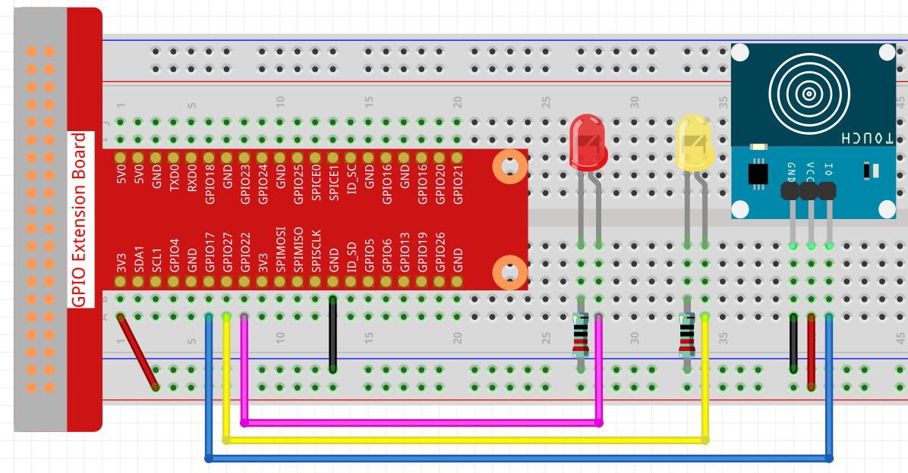

.. note::

    Hello, welcome to the SunFounder Raspberry Pi & Arduino & ESP32 Enthusiasts Community on Facebook! Dive deeper into Raspberry Pi, Arduino, and ESP32 with fellow enthusiasts.

    **Why Join?**

    - **Expert Support**: Solve post-sale issues and technical challenges with help from our community and team.
    - **Learn & Share**: Exchange tips and tutorials to enhance your skills.
    - **Exclusive Previews**: Get early access to new product announcements and sneak peeks.
    - **Special Discounts**: Enjoy exclusive discounts on our newest products.
    - **Festive Promotions and Giveaways**: Take part in giveaways and holiday promotions.

    👉 Ready to explore and create with us? Click [|link_sf_facebook|] and join today!

.. _2.1.3_py_pi5:

2.1.3 Touch Switch Module
=================================

Introduction
-------------------

In this project, you will learn about touch switch module. It can replace the traditional kinds of switch with these advantages: convenient operation, fine touch sense, precise control and least mechanical wear.

Required Components
------------------------------

In this project, we need the following components. 

.. image:: ../python_pi5/img/2.1.3_touch_switch_list.png
    :width: 700
    :align: center

It's definitely convenient to buy a whole kit, here's the link: 

.. list-table::
    :widths: 20 20 20
    :header-rows: 1

    *   - Name	
        - ITEMS IN THIS KIT
        - LINK
    *   - Raphael Kit
        - 337
        - |link_Raphael_kit|

You can also buy them separately from the links below.

.. list-table::
    :widths: 30 20
    :header-rows: 1

    *   - COMPONENT INTRODUCTION
        - PURCHASE LINK

    *   - :ref:`cpn_gpio_extension_board`
        - |link_gpio_board_buy|
    *   - :ref:`cpn_breadboard`
        - |link_breadboard_buy|
    *   - :ref:`cpn_wires`
        - |link_wires_buy|
    *   - :ref:`cpn_resistor`
        - |link_resistor_buy|
    *   - :ref:`cpn_led`
        - |link_led_buy|
    *   - :ref:`cpn_touch_switch`
        - |link_touch_buy|

Schematic Diagram
-----------------

.. image:: ../python_pi5/img/2.1.3_touch_switch_schematic.png
    :width: 500
    :align: center

Experimental Procedures
------------------------------

**Step 1:** Build the circuit.

**Step 2:** Change directory.

.. raw:: html

   <run></run>

.. code-block::

    cd ~/raphael-kit/python-pi5

**Step 3:** Run.

.. raw:: html

   <run></run>

.. code-block::

    sudo python3 2.1.3_TouchSwitch_zero.py

While the code is running, the red LED lights up; when you tap on the touch switch module, the yellow LED turns on. 

.. warning::

    If there is an error prompt  ``RuntimeError: Cannot determine SOC peripheral base address``, please refer to :ref:`faq_soc` 

**Code**

.. note::

    You can **Modify/Reset/Copy/Run/Stop** the code below. But before that, you need to go to  source code path like ``raphael-kit/python-pi5``. After modifying the code, you can run it directly to see the effect.

.. raw:: html

    <run></run>

.. code-block:: python

   #!/usr/bin/env python3
   from gpiozero import LED, Button  # Import LED and Button classes from gpiozero
   from time import sleep  # Import sleep for delay

   # Initialize touch sensor (Button) on GPIO pin 17, pull-up resistor disabled
   touch_sensor = Button(17, pull_up=False)  # Suitable for sensors that pull the pin low when pressed

   # Initialize LED1 and LED2 connected to GPIO pins 22 and 27 respectively
   led1 = LED(22)  # LED1 connected to GPIO pin 22
   led2 = LED(27)  # LED2 connected to GPIO pin 27

   try:
       # Continuously monitor the state of the touch sensor and control LEDs accordingly
       while True:
           if touch_sensor.is_pressed:  # Check if the touch sensor is pressed
               print('You touch it!')  # Output message indicating sensor activation
               led1.off()  # Turn off LED1
               led2.on()   # Turn on LED2
           else:  # If the sensor is not pressed
               led1.on()   # Turn on LED1
               led2.off()  # Turn off LED2

           sleep(0.5)  # Pause for 0.5 seconds before rechecking the sensor state

   except KeyboardInterrupt:
       # Handle a keyboard interrupt (Ctrl+C) for a clean exit from the loop
       pass
	

**Code Explanation**

#. This line sets the script to run with Python 3. It imports ``LED`` and ``Button`` from ``gpiozero`` for controlling GPIO devices, and ``sleep`` from ``time`` for delays.

   .. code-block:: python

       #!/usr/bin/env python3
       from gpiozero import LED, Button  # Import LED and Button classes from gpiozero
       from time import sleep  # Import sleep for delay

#. Initializes a touch sensor (as a Button) on GPIO pin 17 with pull-up disabled, and two LEDs on GPIO pins 22 and 27.

   .. code-block:: python

       # Initialize touch sensor (Button) on GPIO pin 17, pull-up resistor disabled
       touch_sensor = Button(17, pull_up=False)  # Suitable for sensors that pull the pin low when pressed

       # Initialize LED1 and LED2 connected to GPIO pins 22 and 27 respectively
       led1 = LED(22)  # LED1 connected to GPIO pin 22
       led2 = LED(27)  # LED2 connected to GPIO pin 27

#. The main loop checks the state of the touch sensor. When touched, LED2 turns on and LED1 off; when not touched, LED1 is on and LED2 off. The loop repeats every 0.5 seconds. Catches a KeyboardInterrupt (like Ctrl+C) to allow for graceful script termination.

   .. code-block:: python

       try:
           # Continuously monitor the state of the touch sensor and control LEDs accordingly
           while True:
               if touch_sensor.is_pressed:  # Check if the touch sensor is pressed
                   print('You touch it!')  # Output message indicating sensor activation
                   led1.off()  # Turn off LED1
                   led2.on()   # Turn on LED2
               else:  # If the sensor is not pressed
                   led1.on()   # Turn on LED1
                   led2.off()  # Turn off LED2

               sleep(0.5)  # Pause for 0.5 seconds before rechecking the sensor state

       except KeyboardInterrupt:
           # Handle a keyboard interrupt (Ctrl+C) for a clean exit from the loop
           pass

