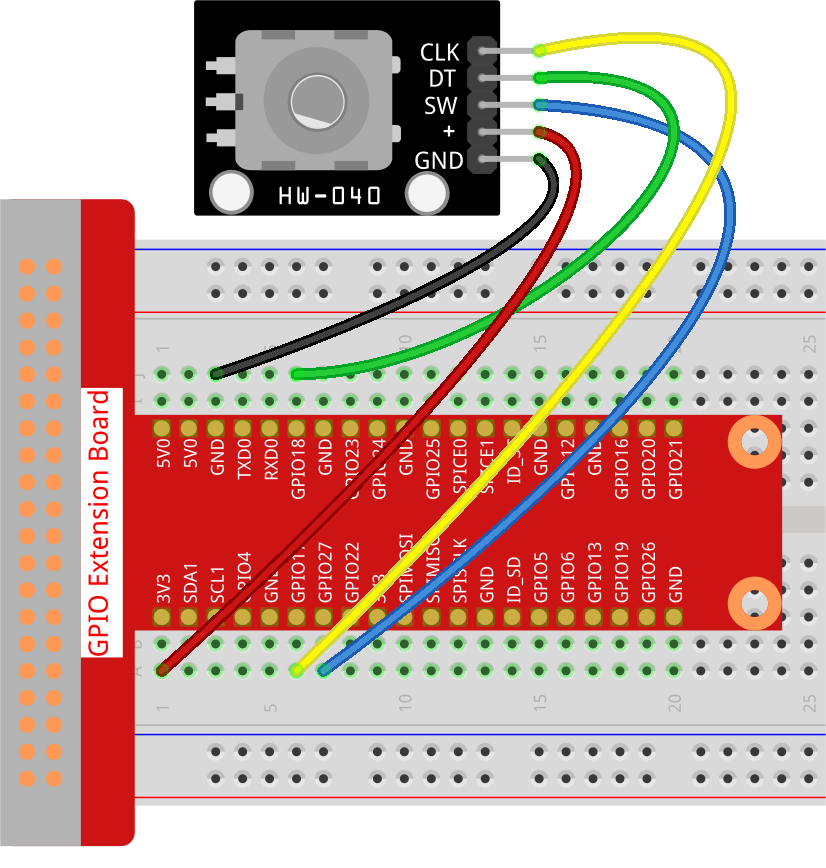

.. note::

    ¡Hola! Bienvenido a la Comunidad de Entusiastas de SunFounder Raspberry Pi, Arduino y ESP32 en Facebook. Profundiza en Raspberry Pi, Arduino y ESP32 con otros entusiastas.

    **¿Por qué unirte?**

    - **Soporte experto**: Resuelve problemas post-venta y desafíos técnicos con la ayuda de nuestra comunidad y equipo.
    - **Aprende y comparte**: Intercambia consejos y tutoriales para mejorar tus habilidades.
    - **Preestrenos exclusivos**: Accede anticipadamente a anuncios de nuevos productos y adelantos.
    - **Descuentos especiales**: Disfruta de descuentos exclusivos en nuestros productos más recientes.
    - **Promociones y sorteos festivos**: Participa en sorteos y promociones de temporada.

    👉 ¿Listo para explorar y crear con nosotros? Haz clic en [|link_sf_facebook|] y únete hoy mismo.

.. _2.1.6_py_pi5:

2.1.6 Módulo de Codificador Rotatorio
===========================================

Introducción
---------------

En este proyecto, aprenderás sobre el codificador rotatorio. Un codificador rotatorio 
es un interruptor electrónico con un conjunto de pulsos regulares en una secuencia de 
tiempo estrictamente definida. Cuando se usa con un CI, puede lograr incrementos, decrementos, 
cambio de página y otras operaciones como el desplazamiento del mouse, selección de menús, etc.

Componentes Necesarios
--------------------------

En este proyecto, necesitamos los siguientes componentes.

.. image:: ../python_pi5/img/2.1.6_rotary_encoder_list.png

Es definitivamente conveniente comprar un kit completo, aquí está el enlace:

.. list-table::
    :widths: 20 20 20
    :header-rows: 1

    *   - Nombre	
        - ELEMENTOS EN ESTE KIT
        - ENLACE
    *   - Kit Raphael
        - 337
        - |link_Raphael_kit|

También puedes comprarlos por separado en los enlaces a continuación.

.. list-table::
    :widths: 30 20
    :header-rows: 1

    *   - INTRODUCCIÓN DE COMPONENTES
        - ENLACE DE COMPRA

    *   - :ref:`cpn_gpio_board`
        - |link_gpio_board_buy|
    *   - :ref:`cpn_breadboard`
        - |link_breadboard_buy|
    *   - :ref:`cpn_wires`
        - |link_wires_buy|
    *   - :ref:`cpn_rotary_encoder`
        - |link_rotary_encoder_buy|

Diagrama Esquemático
-------------------------

.. image:: ../python_pi5/img/2.1.6_rotary_encoder_schematic.png
   :align: center

Procedimientos Experimentales
-----------------------------------

**Paso 1:** Construir el circuito.

En este ejemplo, podemos conectar el pin del Codificador Rotatorio directamente a la 
Raspberry Pi usando una placa de pruebas y un cable de 40 pines, conectar el GND del 
Codificador Rotatorio a GND, 「+」a 3.3V, SW a GPIO27, DT a GPIO18, y CLK a GPIO17.

**Paso 2:** Abrir el archivo de código.

.. raw:: html

   <run></run>

.. code-block::

    cd ~/raphael-kit/python-pi5

**Paso 3:** Ejecutar.

.. raw:: html

   <run></run>

.. code-block::

    sudo python3 2.1.6_RotaryEncoder_zero.py

Verás el conteo en la consola. Cuando giras el codificador rotatorio en el sentido de las agujas del reloj, el conteo aumenta; cuando lo giras en sentido contrario, el conteo disminuye. Si presionas el interruptor del codificador rotatorio, las lecturas volverán a cero.

.. warning::

    Si recibe el mensaje de error ``RuntimeError: Cannot determine SOC peripheral base address``, consulte :ref:`faq_soc`

**Código**

.. note::

   Puedes **Modificar/Restablecer/Copiar/Ejecutar/Detener** el código a continuación. Pero antes de eso, debes ir a la ruta del código fuente como ``raphael-kit/python-pi5``. Después de modificar el código, puedes ejecutarlo directamente para ver el efecto.

.. raw:: html

    <run></run>

.. code-block:: python

   #!/usr/bin/env python3
   from gpiozero import RotaryEncoder, Button
   from time import sleep

   # Inicializa el codificador rotatorio y el botón
   encoder = RotaryEncoder(a=17, b=18)  # Codificador Rotatorio conectado a los pines GPIO 17 (CLK) y 18 (DT)
   button = Button(27)                  # Botón conectado al pin GPIO 27

   global_counter = 0  # Variable global para seguir la posición del codificador rotatorio

   def rotary_change():
      """ Update the global counter based on the rotary encoder's rotation. """
      global global_counter
      global_counter += encoder.steps  # Adjust counter based on encoder steps
      encoder.steps = 0  # Reset encoder steps after updating counter
      print('Global Counter =', global_counter)  # Display current counter value

   def reset_counter():
      """ Reset the global counter to zero when the button is pressed. """
      global global_counter
      global_counter = 0  # Reset the counter
      print('Counter reset')  # Indicate counter reset

   # Asigna la función reset_counter al evento de presionar el botón
   button.when_pressed = reset_counter

   try:
      # Monitorea el codificador rotatorio continuamente y procesa los cambios
      while True:
         rotary_change()  # Maneja los cambios del codificador rotatorio
         sleep(0.1)  # Breve retraso para reducir la carga de la CPU

   except KeyboardInterrupt:
      # Maneja de manera ordenada una interrupción de teclado (Ctrl+C)
      pass

**Análisis del Código**

#. Importa las clases ``RotaryEncoder`` y ``Button`` de la biblioteca ``gpiozero``, y la función ``sleep`` para los retrasos.

   .. code-block:: python

      #!/usr/bin/env python3
      from gpiozero import RotaryEncoder, Button
      from time import sleep

#. Inicializa el codificador rotatorio con los pines GPIO 17 y 18, y un botón en el pin GPIO 27.

   .. code-block:: python

      # Inicializa el codificador rotatorio y el botón
      encoder = RotaryEncoder(a=17, b=18)  # Codificador Rotatorio conectado a los pines GPIO 17 (CLK) y 18 (DT)
      button = Button(27)                  # Botón conectado al pin GPIO 27

#. Declares a global variable ``global_counter`` to track the position of the rotary encoder.

   .. code-block:: python

      global_counter = 0  # Variable global para seguir la posición del codificador rotatorio

#. Defines a function ``rotary_change`` to update the global counter based on the rotary encoder's rotation.

   .. code-block:: python

      def rotary_change():
         """ Update the global counter based on the rotary encoder's rotation. """
         global global_counter
         global_counter += encoder.steps  # Adjust counter based on encoder steps
         encoder.steps = 0  # Reset encoder steps after updating counter
         print('Global Counter =', global_counter)  # Display current counter value

#. Defines a function ``reset_counter`` to reset the global counter to zero when the button is pressed.

   .. code-block:: python

      def reset_counter():
         """ Reset the global counter to zero when the button is pressed. """
         global global_counter
         global_counter = 0  # Reset the counter
         print('Counter reset')  # Indicate counter reset

#. Assigns the ``reset_counter`` function to be called when the button is pressed.

   .. code-block:: python

      # Asigna la función reset_counter al evento de presionar el botón
      button.when_pressed = reset_counter

#. In a continuous loop, the script calls ``rotary_change`` to handle rotary encoder changes and introduces a short delay to reduce CPU load. Uses a try-except block to handle KeyboardInterrupts gracefully.

   .. code-block:: python

      try:
         # Monitorea el codificador rotatorio continuamente y procesa los cambios
         while True:
            rotary_change()  # Maneja los cambios del codificador rotatorio
            sleep(0.1)  # Breve retraso para reducir la carga de la CPU

      except KeyboardInterrupt:
         # Maneja de manera ordenada una interrupción de teclado (Ctrl+C)
         pass

