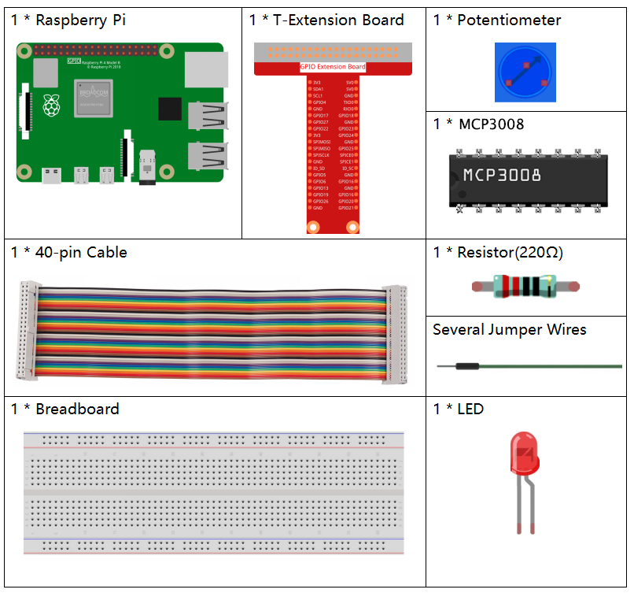
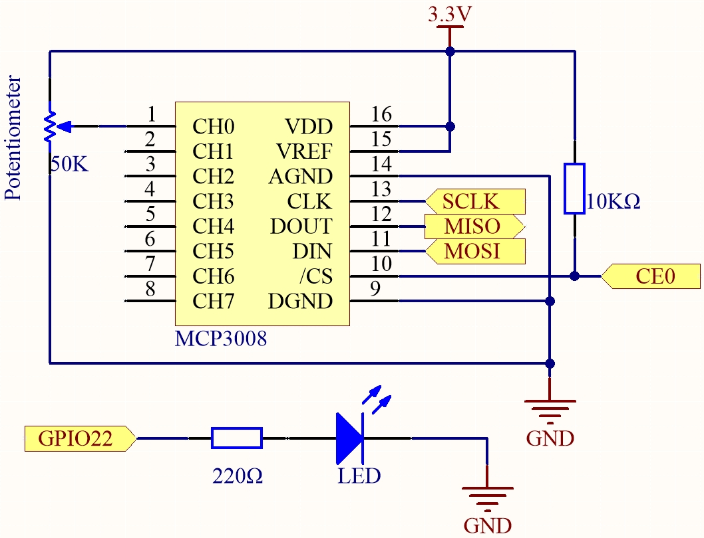
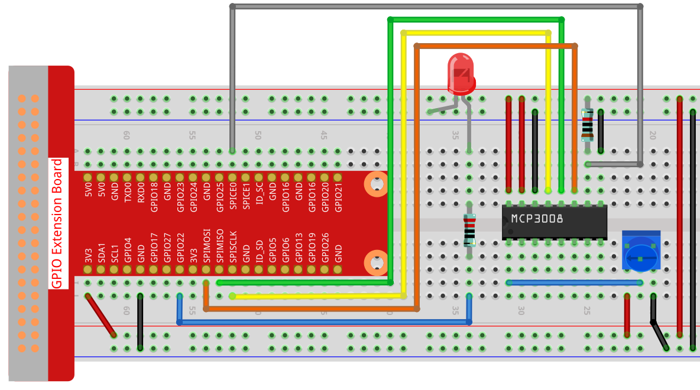

.. note::

    ¡Hola, bienvenido a la Comunidad de Entusiastas de SunFounder Raspberry Pi & Arduino & ESP32 en Facebook! Sumérgete en el mundo de Raspberry Pi, Arduino y ESP32 junto a otros entusiastas.

    **¿Por qué unirse?**

    - **Soporte experto**: Resuelve problemas postventa y desafíos técnicos con la ayuda de nuestra comunidad y equipo.
    - **Aprender y compartir**: Intercambia consejos y tutoriales para mejorar tus habilidades.
    - **Preestrenos exclusivos**: Obtén acceso anticipado a nuevos anuncios de productos y adelantos.
    - **Descuentos especiales**: Disfruta de descuentos exclusivos en nuestros productos más recientes.
    - **Promociones y sorteos festivos**: Participa en sorteos y promociones especiales de temporada.

    👉 ¿Listo para explorar y crear con nosotros? Haz clic en [|link_sf_facebook|] y únete hoy mismo.

.. _2.1.7_py_pi5_mcp3008:

2.1.7 Potenciómetro (MCP3008)
=============================

.. note::

   .. image:: ../img/mcp3008_and_adc0834.jpg
      :width: 25%
      :align: left
    

   Dependiendo de la versión de tu kit, identifica si tienes **ADC0834** o **MCP3008** y procede con la sección correspondiente.

Introducción
------------

La función ADC se utiliza para convertir señales analógicas en valores digitales.  
En este experimento, utilizamos el chip ADC MCP3008 para realizar esta conversión.  
Un potenciómetro se utiliza para generar un voltaje variable, que cambia la magnitud física.  
El MCP3008 convierte entonces este voltaje analógico en un valor digital que puede ser leído y procesado por la Raspberry Pi.

Componentes requeridos
----------------------

En este proyecto, necesitamos los siguientes componentes. 

Es definitivamente conveniente comprar un kit completo, aquí tienes el enlace: 

.. list-table::
    :widths: 20 20 20
    :header-rows: 1

    *   - Nombre	
        - ELEMENTOS EN ESTE KIT
        - ENLACE
    *   - Kit Raphael
        - 337
        - |link_Raphael_kit|

También puedes comprarlos por separado en los siguientes enlaces.

.. list-table::
    :widths: 30 20
    :header-rows: 1

    *   - INTRODUCCIÓN DEL COMPONENTE
        - ENLACE DE COMPRA

    *   - :ref:`cpn_gpio_board`
        - |link_gpio_board_buy|
    *   - :ref:`cpn_breadboard`
        - |link_breadboard_buy|
    *   - :ref:`cpn_wires`
        - |link_wires_buy|
    *   - :ref:`cpn_resistor`
        - |link_resistor_buy|
    *   - :ref:`cpn_led`
        - |link_led_buy|
    *   - :ref:`cpn_potentiometer`
        - |link_potentiometer_buy|
    *   - :ref:`cpn_mcp3008`
        - \-

Diagrama esquemático
--------------------

.. list-table::
    :widths: 30 30 30 30
    :header-rows: 1

    *   - Nombre 
        - T-Board
        - WiringPi
        - BCM

    *   - SPICE0
        - pin24
        - 10
        - 8
    *   - SPIMOSI
        - pin19
        - 12
        - 10
    *   - SPIMISO
        - pin21
        - 13
        - 9
    *   - SPISCLK
        - pin23
        - 14
        - 11
    *   - GPIO22
        - pin15
        - 3
        - 22

Procedimientos experimentales
-----------------------------

**Paso 1:** Construye el circuito.

.. note::
    Coloca el chip siguiendo la posición correspondiente mostrada en la imagen.  
    Ten en cuenta que la muesca del chip debe estar a la izquierda cuando se coloque.

**Paso 2:** Configura la interfaz SPI e instala la librería ``spidev`` (consulta :ref:`spi_configuration` para obtener instrucciones detalladas).  
Si ya has completado estos pasos, puedes omitirlos.

**Paso 3:** Abre el archivo de código

.. raw:: html

   <run></run>

.. code-block::

    cd ~/raphael-kit/python-pi5

**Paso 4:** Ejecuta el programa.

.. raw:: html

   <run></run>

.. code-block::

    sudo python3 2.1.7-2_Potentiometer_zero.py

Después de ejecutar el código, gira la perilla del potenciómetro, la intensidad del LED cambiará en consecuencia.

.. warning::

    Si aparece el error ``RuntimeError: Cannot determine SOC peripheral base address``, consulta :ref:`faq_soc` 

Código
------

.. note::

    Puedes **Modificar/Restablecer/Copiar/Ejecutar/Detener** el código siguiente.  
    Pero antes de eso, necesitas ir a la ruta del código fuente como ``raphael-kit/python-pi5``.  
    Después de modificar el código, puedes ejecutarlo directamente para ver el efecto.

.. raw:: html

    <run></run>

.. code-block:: python

    #!/usr/bin/env python3

    import spidev
    import time
    from gpiozero import PWMLED

    # Inicializar LED PWM en GPIO22
    led = PWMLED(22)

    # Inicializar SPI
    spi = spidev.SpiDev()
    spi.open(0, 0)  # Bus 0, CS0 (CE0)
    spi.max_speed_hz = 1000000

    def read_adc(channel):
        """
        Leer valor analógico del MCP3008
        :param channel: canal ADC (0-7)
        :return: entero de 10 bits (0-1023)
        """
        if channel < 0 or channel > 7:
            return -1
        # Protocolo MCP3008
        adc = spi.xfer2([1, (8 + channel) << 4, 0])
        value = ((adc[1] & 3) << 8) | adc[2]
        return value

    def MAP(x, in_min, in_max, out_min, out_max):
        """
        Mapear un valor de un rango a otro
        """
        return (x - in_min) * (out_max - out_min) / (in_max - in_min) + out_min

    try:
        while True:
            # Leer del canal 0 de MCP3008
            res = read_adc(0)
            print('res = %d' % res)

            # Mapear 0–1023 a 0–100%
            R_val = MAP(res, 0, 1023, 0, 100)

            # Ajustar brillo del LED
            led.value = R_val / 100.0

            time.sleep(0.2)

    except KeyboardInterrupt:
        led.value = 0  # Apagar el LED

Explicación del código
----------------------

#. ``gpiozero`` para el control del LED PWM, ``spidev`` para la comunicación SPI con MCP3008 y ``time`` para implementar retardos.

   .. code-block:: python

       #!/usr/bin/env python3

       import spidev
       import time
       from gpiozero import PWMLED

#. Inicializa un objeto PWMLED conectado al pin GPIO 22 y configura la comunicación SPI (Bus 0, CE0) con MCP3008.

   .. code-block:: python

       # Inicializar LED PWM en GPIO22
       led = PWMLED(22)

       # Inicializar SPI
       spi = spidev.SpiDev()
       spi.open(0, 0)  # Bus 0, CS0 (CE0)
       spi.max_speed_hz = 1000000

#. Define una función llamada ``read_adc`` para comunicarse con MCP3008 y leer valores analógicos del canal especificado (0–7).

   .. code-block:: python

       def read_adc(channel):
           """
           Leer valor analógico del MCP3008
           :param channel: canal ADC (0-7)
           :return: entero de 10 bits (0-1023)
           """
           if channel < 0 or channel > 7:
               return -1
           adc = spi.xfer2([1, (8 + channel) << 4, 0])
           value = ((adc[1] & 3) << 8) | adc[2]
           return value

#. Define una función llamada ``MAP`` para convertir un rango de valores a otro, útil para mapear valores ADC a niveles adecuados de brillo del LED.

   .. code-block:: python

       def MAP(x, in_min, in_max, out_min, out_max):
           return (x - in_min) * (out_max - out_min) / (in_max - in_min) + out_min

#. Lee continuamente el valor ADC en un bucle, mapeando el valor ADC de 10 bits (0–1023) a un nivel de brillo (0–100) para el LED. Ajusta el brillo del LED en consecuencia. Espera 0.2 segundos entre cada lectura.

   .. code-block:: python

       try:
           while True:
               # Leer del canal 0 de MCP3008
               res = read_adc(0)
               print('res = %d' % res)

               # Mapear 0–1023 a 0–100%
               R_val = MAP(res, 0, 1023, 0, 100)

               # Ajustar brillo del LED
               led.value = R_val / 100.0

               time.sleep(0.2)

       except KeyboardInterrupt:
           led.value = 0  # Apagar el LED
