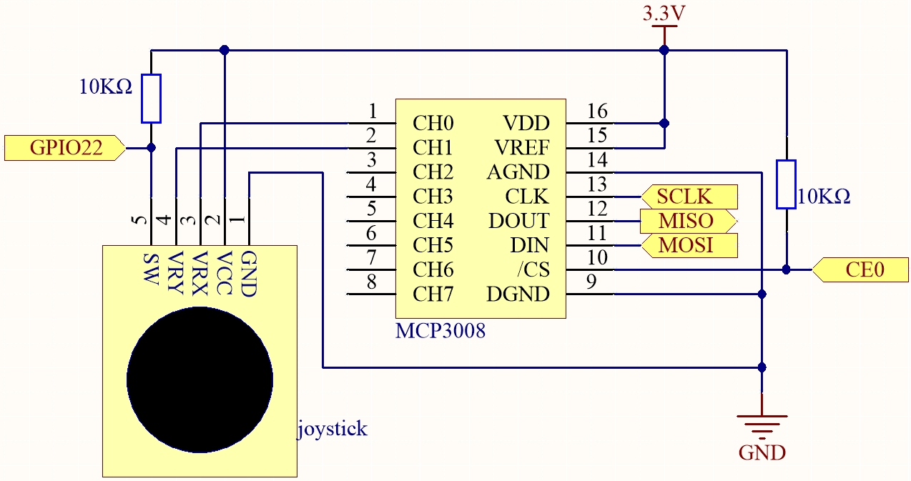

.. note::

    こんにちは、SunFounder Raspberry Pi & Arduino & ESP32 愛好者コミュニティ (Facebook) へようこそ！  
    Raspberry Pi、Arduino、ESP32 を仲間と共にさらに深く学びましょう。

    **参加する理由**

    - **専門サポート**: 購入後の問題や技術的課題をコミュニティとチームで解決  
    - **学びと共有**: ヒントや学習資料を交換し、技術力を向上  
    - **限定プレビュー**: 新製品情報や先行発表に早期アクセス  
    - **特別割引**: 新製品を特別価格で購入可能  
    - **イベントと景品企画**: 景品イベントや季節ごとのキャンペーンに参加  

    👉 一緒に探求し、ものづくりを楽しみましょう。[|link_sf_facebook|] をクリックして参加！

.. _2.1.9_py_pi5_mcp3008:

2.1.9 ジョイスティック (MCP3008)
=================================

.. note::

   .. image:: ../img/mcp3008_and_adc0834.jpg
      :width: 25%
      :align: left
     
   キットのバージョンに応じて **ADC0834** または **MCP3008** が含まれています。  
   お手持ちのバージョンに対応する章をご参照ください。

概要
----

このプロジェクトでは、ジョイスティックの動作原理を学びます。  
ジョイスティックを動かし、その結果を画面に表示します。

必要な部品
----------

本プロジェクトで必要な部品は次のとおりです。

.. image:: ../python_pi5/img/image317-copy.png

キット一式で購入すると便利です。リンクはこちら：

.. list-table::
    :widths: 20 20 20
    :header-rows: 1

    *   - 名称  
        - キット内数量  
        - リンク
    *   - Raphael Kit  
        - 337  
        - |link_Raphael_kit|

個別に購入することもできます。以下のリンクをご参照ください。

.. list-table::
    :widths: 30 20
    :header-rows: 1

    *   - 部品紹介  
        - 購入リンク
    *   - :ref:`cpn_gpio_extension_board`  
        - |link_gpio_board_buy|
    *   - :ref:`cpn_breadboard`  
        - |link_breadboard_buy|
    *   - :ref:`cpn_wires`  
        - |link_wires_buy|
    *   - :ref:`cpn_resistor`  
        - |link_resistor_buy|
    *   - :ref:`cpn_joystick`  
        - \-
    *   - :ref:`cpn_mcp3008`  
        - \-

回路図
------

ジョイスティックのデータを読む際、X 軸と Y 軸のデータはアナログであり、  
MCP3008 を用いてデジタル値に変換する必要があります。  
Z 軸のデータはデジタル信号なので、GPIO から直接読み取ることができます（または ADC を介しても可能）。

.. list-table::
    :widths: 30 30 30 30
    :header-rows: 1

    *   - T-Board 名  
        - physical  
        - WiringPi  
        - BCM
    *   - SPICE0  
        - pin24  
        - 10  
        - 8
    *   - SPIMOSI  
        - pin19  
        - 12  
        - 10
    *   - SPIMISO  
        - pin21  
        - 13  
        - 9
    *   - SPISCLK  
        - pin23  
        - 14  
        - 11
    *   - GPIO22  
        - pin15  
        - 3  
        - 22

実験手順
--------

**ステップ 1:** 回路を組み立てます。

.. image:: ../python_pi5/img/july24_2.1.9_joystick_mcp3008.png

**ステップ 2:** SPI インターフェースを設定し、 ``spidev`` ライブラリをインストールします（詳細は :ref:`spi_configuration` 参照）。すでに設定済みの場合は省略可能です。

**ステップ 3:** コードがあるフォルダへ移動します。

.. raw:: html

   <run></run>

.. code-block::

    cd ~/raphael-kit/python-pi5

**ステップ 4:** 実行します。

.. raw:: html

   <run></run>

.. code-block::

    sudo python3 2.1.9-2_Joystick_zero.py

コード実行後、ジョイスティックを動かすと、x, y, Btn の対応する値が画面に表示されます。

.. warning::

    ``RuntimeError: Cannot determine SOC peripheral base address`` エラーが表示された場合は :ref:`faq_soc` を参照してください。

コード
------

.. note::
    以下のコードは **修正／リセット／コピー／実行／停止** が可能です。  
    その前に ``raphael-kit/python-pi5`` のソースコードパスに移動してください。変更後、直接実行して結果を確認できます。

.. raw:: html

    <run></run>

.. code-block:: python

    #!/usr/bin/env python3

    from gpiozero import Button
    import spidev
    import time

    # Initialize the button connected to GPIO pin 22 (joystick SW pin)
    BtnPin = Button(22)

    # Initialize SPI communication with MCP3008
    spi = spidev.SpiDev()
    spi.open(0, 0)  # Open SPI bus 0, device CE0
    spi.max_speed_hz = 1000000  # Set SPI speed to 1 MHz

    def read_adc(channel):
        """
        Reads analog value from the specified MCP3008 channel (0–7)
        :param channel: ADC channel number (0–7)
        :return: 10-bit integer value (0–1023)
        """
        if channel < 0 or channel > 7:
            return -1
        adc = spi.xfer2([1, (8 + channel) << 4, 0])
        value = ((adc[1] & 0x03) << 8) | adc[2]
        return value

    try:
        # Main loop to read and print joystick values and button state
        while True:
            # Read X and Y values from MCP3008 channels 0 and 1
            x_val = read_adc(0)  # Joystick VRX connected to CH0
            y_val = read_adc(1)  # Joystick VRY connected to CH1

            # Read the state of the joystick button (SW)
            Btn_val = BtnPin.value  # 0 = pressed, 1 = released

            # Print the read values
            print('X: %d  Y: %d  Btn: %d' % (x_val, y_val, Btn_val))

            # Wait 0.2 seconds before the next reading
            time.sleep(0.2)

    # Gracefully handle Ctrl+C interruption
    except KeyboardInterrupt:
        spi.close()

コード解説
----------

1. 必要なライブラリを読み込みます：

   * ``gpiozero.Button`` はジョイスティックのスイッチ状態（SW ピン）を取得するために使用します。  
   * ``spidev`` は MCP3008 ADC チップとの SPI 通信に使用します。  
   * ``time`` は測定間の待機に使用します。

   .. code-block:: python

       #!/usr/bin/env python3
       from gpiozero import Button
       import spidev
       import time

2. GPIO22（ジョイスティック SW ピン）をボタン入力として設定し、SPI 通信をバス0・デバイス CE0 で初期化、速度を 1MHz に設定します。

   .. code-block:: python

       # Initialize the button connected to GPIO pin 22 (joystick SW pin)
       BtnPin = Button(22)

       # Initialize SPI communication with MCP3008
       spi = spidev.SpiDev()
       spi.open(0, 0)  # Open SPI bus 0, device CE0
       spi.max_speed_hz = 1000000  # Set SPI speed to 1 MHz

3. ``read_adc(channel)`` 関数は MCP3008 の指定したチャンネル（0〜7）からアナログ値を読み取ります。SPI で 3 バイトを送受信し、10 ビットの値 (0〜1023) を返します。

   .. code-block:: python

       def read_adc(channel):
           """
           Reads analog value from the specified MCP3008 channel (0–7)
           :param channel: ADC channel number (0–7)
           :return: 10-bit integer value (0–1023)
           """
           if channel < 0 or channel > 7:
               return -1
           adc = spi.xfer2([1, (8 + channel) << 4, 0])
           value = ((adc[1] & 0x03) << 8) | adc[2]
           return value

4. メインループでは、VRX (CH0 接続) と VRY (CH1 接続) のアナログ値、ジョイスティックボタンの状態を読み取り、0.2 秒ごとにコンソールへ表示します。Ctrl+C が押されると SPI インターフェースを閉じて終了します。

   .. code-block:: python

       try:
           # Main loop to read and print joystick values and button state
           while True:
               # Read X and Y values from MCP3008 channels 0 and 1
               x_val = read_adc(0)  # Joystick VRX connected to CH0
               y_val = read_adc(1)  # Joystick VRY connected to CH1

               # Read the state of the joystick button (SW)
               Btn_val = BtnPin.value  # 0 = pressed, 1 = released

               # Print the read values
               print('X: %d  Y: %d  Btn: %d' % (x_val, y_val, Btn_val))

               # Wait 0.2 seconds before the next reading
               time.sleep(0.2)

       # Gracefully handle Ctrl+C interruption
       except KeyboardInterrupt:
           spi.close()
