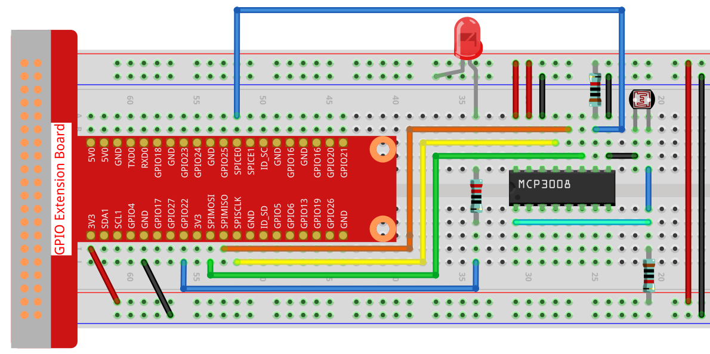

.. note::

    Hallo, willkommen in der SunFounder Raspberry Pi & Arduino & ESP32 Enthusiasten-Community auf Facebook!  
    Tauchen Sie tiefer in Raspberry Pi, Arduino und ESP32 mit anderen Enthusiasten ein.

    **Warum beitreten?**

    - **Expertenunterstützung**: Lösen Sie nach dem Kauf auftretende Probleme und technische Herausforderungen mit Hilfe unserer Community und unseres Teams.
    - **Lernen & Teilen**: Tauschen Sie Tipps und Tutorials aus, um Ihre Fähigkeiten zu verbessern.
    - **Exklusive Vorschauen**: Erhalten Sie frühzeitigen Zugriff auf neue Produktankündigungen und exklusive Einblicke.
    - **Sonderrabatte**: Genießen Sie exklusive Rabatte auf unsere neuesten Produkte.
    - **Festliche Aktionen und Verlosungen**: Nehmen Sie an Verlosungen und Feiertagsaktionen teil.

    👉 Bereit, mit uns zu forschen und zu kreieren? Klicken Sie auf [|link_sf_facebook|] und treten Sie noch heute bei!

.. _2.2.1_py_pi5_mcp3008:

2.2.1 Fotowiderstand (MCP3008)
===============================

.. note::

   .. image:: ../img/mcp3008_and_adc0834.jpg
      :width: 25%
      :align: left

   Abhängig von Ihrer Kit-Version identifizieren Sie bitte, ob Sie **ADC0834** oder **MCP3008** haben, und fahren Sie mit dem entsprechenden Abschnitt fort.

Einführung
------------

Der Fotowiderstand ist ein häufig verwendetes Bauteil zur Erfassung der Umgebungslichtintensität.  
Er hilft dem Controller, Tag und Nacht zu erkennen und Lichtsteuerungsfunktionen wie Nachtlampen zu realisieren.  
Dieses Projekt ähnelt sehr dem Potentiometer, wobei Sie vielleicht denken, dass es die Spannung ändert, um Licht zu erfassen.

Benötigte Komponenten
------------------------------

In diesem Projekt benötigen wir die folgenden Komponenten:

.. image:: ../python_pi5/img/list2_2.2.1_photoresistor.png

Es ist definitiv bequem, ein komplettes Kit zu kaufen. Hier ist der Link: 

.. list-table::
    :widths: 20 20 20
    :header-rows: 1

    *   - Name	
        - ELEMENTE IN DIESEM KIT
        - LINK
    *   - Raphael Kit
        - 337
        - |link_Raphael_kit|

Sie können sie auch einzeln über die untenstehenden Links kaufen.

.. list-table::
    :widths: 30 20
    :header-rows: 1

    *   - KOMPONENTENBESCHREIBUNG
        - KAUFLINK

    *   - :ref:`cpn_gpio_extension_board`
        - |link_gpio_board_buy|
    *   - :ref:`cpn_breadboard`
        - |link_breadboard_buy|
    *   - :ref:`cpn_wires`
        - |link_wires_buy|
    *   - :ref:`cpn_resistor`
        - |link_resistor_buy|
    *   - :ref:`cpn_led`
        - |link_led_buy|
    *   - :ref:`cpn_mcp3008`
        - \-
    *   - :ref:`cpn_photoresistor`
        - |link_photoresistor_buy|

Schaltplan
-----------------

.. list-table::
    :widths: 30 30 30 30
    :header-rows: 1

    *   - T-Board Name
        - Physikalisch
        - WiringPi
        - BCM

    *   - SPICE0
        - Pin24
        - 10
        - 8
    *   - SPIMOSI
        - Pin19
        - 12
        - 10
    *   - SPIMISO
        - Pin21
        - 13
        - 9
    *   - SPISCLK
        - Pin23
        - 14
        - 11
    *   - GPIO22
        - Pin15
        - 3
        - 22

.. image:: ../python_pi5/img/schematic_2.2.1_photoresistor_mcp3008.png

Experimentelle Verfahren
-----------------------------------

**Schritt 1:** Bauen Sie die Schaltung auf.

**Schritt 2:** Richten Sie die SPI-Schnittstelle ein und installieren Sie die ``spidev``-Bibliothek (siehe :ref:`spi_configuration` für detaillierte Anweisungen). Wenn Sie diese Schritte bereits abgeschlossen haben, können Sie diesen Schritt überspringen.

**Schritt 3:** Wechseln Sie in den Code-Ordner.

.. raw:: html

   <run></run>

.. code-block::

    cd ~/raphael-kit/python-pi5

**Schritt 4:** Führen Sie die ausführbare Datei aus.

.. raw:: html

   <run></run>

.. code-block::

    sudo python3 2.2.1-2_Photoresistor_zero.py

Wenn der Code ausgeführt wird, ändert sich die Helligkeit der LED entsprechend der vom Fotowiderstand erfassten Lichtintensität.

.. warning::

    Wenn die Fehlermeldung ``RuntimeError: Cannot determine SOC peripheral base address`` angezeigt wird, lesen Sie bitte :ref:`faq_soc`.

**Code**

.. note::

    Sie können den untenstehenden Code **Ändern/Zurücksetzen/Kopieren/Ausführen/Stoppen**.  
    Vorher müssen Sie jedoch zum Quellcodepfad wie ``raphael-kit/python-pi5`` wechseln.  
    Nach dem Ändern des Codes können Sie ihn direkt ausführen, um das Ergebnis zu sehen.

.. raw:: html

    <run></run>

.. code-block:: python

    #!/usr/bin/env python3
    import spidev
    import time
    from gpiozero import PWMLED

    # Initialisiere eine PWM-LED auf GPIO-Pin 22
    led = PWMLED(22)

    # Initialisiere SPI-Kommunikation (Bus 0, CE0 -> GPIO8)
    spi = spidev.SpiDev()
    spi.open(0, 0)  # Bus 0, CS0
    spi.max_speed_hz = 1000000  # 1 MHz

    # Funktion zum Lesen von MCP3008-Kanal (0–7)
    def read_adc(channel):
        """
        Lese analogen Wert vom MCP3008 (0–1023)
        """
        if channel < 0 or channel > 7:
            return -1
        # MCP3008-Protokoll: Startbit, Single-Ended-Modus, Kanal (3 Bit), Füller
        r = spi.xfer2([1, (8 + channel) << 4, 0])
        value = ((r[1] & 3) << 8) | r[2]
        return value

    # Funktion zum Umrechnen von Werten aus einem Bereich in einen anderen
    def MAP(x, in_min, in_max, out_min, out_max):
        return (x - in_min) * (out_max - out_min) / (in_max - in_min) + out_min

    # Hauptschleife zum Lesen des ADC-Wertes und Steuern der LED-Helligkeit
    def loop():
        while True:
            # Lese analogen Wert vom Kanal 0 des MCP3008
            analogVal = read_adc(0)
            print('Wert = %d' % analogVal)

            # 0–1023 auf PWM-Bereich 0.0–1.0 abbilden
            led.value = analogVal / 1023.0

            # 0,2 Sekunden warten
            time.sleep(0.2)

    # Hauptschleife starten und KeyboardInterrupt abfangen
    try:
        loop()
    except KeyboardInterrupt:
        led.value = 0  # LED ausschalten vor Beenden

**Code-Erklärung**

#. Importiert die Klasse ``PWMLED`` aus der ``gpiozero``-Bibliothek zum Steuern von PWM-LEDs, ``spidev`` für SPI-Kommunikation mit dem MCP3008 und ``time`` für Wartezeiten.

   .. code-block:: python

       import spidev
       import time
       from gpiozero import PWMLED

#. Initialisiert eine PWM-LED, die an GPIO-Pin 22 angeschlossen ist, und richtet die SPI-Schnittstelle für den MCP3008 ein (Bus 0, CE0). Die SPI-Taktrate wird auf 1 MHz gesetzt.

   .. code-block:: python

       led = PWMLED(22)
       spi = spidev.SpiDev()
       spi.open(0, 0)
       spi.max_speed_hz = 1000000

#. Definiert eine Funktion, um von einem bestimmten MCP3008-ADC-Kanal zu lesen. Es wird ein 3-Byte-Befehl über SPI gesendet und ein 10-Bit-Wert (0–1023) aus der Antwort extrahiert.

   .. code-block:: python

       def read_adc(channel):
           r = spi.xfer2([1, (8 + channel) << 4, 0])
           value = ((r[1] & 3) << 8) | r[2]
           return value

#. Definiert eine Hilfsfunktion ``MAP()``, die eine Zahl von einem Bereich in einen anderen umrechnet. Dies ist nützlich, um rohe ADC-Werte in geeignete PWM-Werte umzuwandeln.

   .. code-block:: python

       def MAP(x, in_min, in_max, out_min, out_max):
           return (x - in_min) * (out_max - out_min) / (in_max - in_min) + out_min

#. Implementiert eine Schleife, die wiederholt einen analogen Wert von Kanal 0 des MCP3008 liest, ihn in einen PWM-Helligkeitswert (0.0–1.0) umrechnet und diesen auf die LED anwendet. Die Schleife pausiert jeweils 0,2 Sekunden.

   .. code-block:: python

       def loop():
           while True:
               analogVal = read_adc(0)
               print('Wert = %d' % analogVal)
               led.value = analogVal / 1023.0
               time.sleep(0.2)

#. Führt die Schleife aus und behandelt ``KeyboardInterrupt`` sauber. Wenn der Benutzer das Programm beendet (Ctrl+C), wird die LED vor dem Beenden ausgeschaltet.

   .. code-block:: python

       try:
           loop()
       except KeyboardInterrupt:
           led.value = 0
