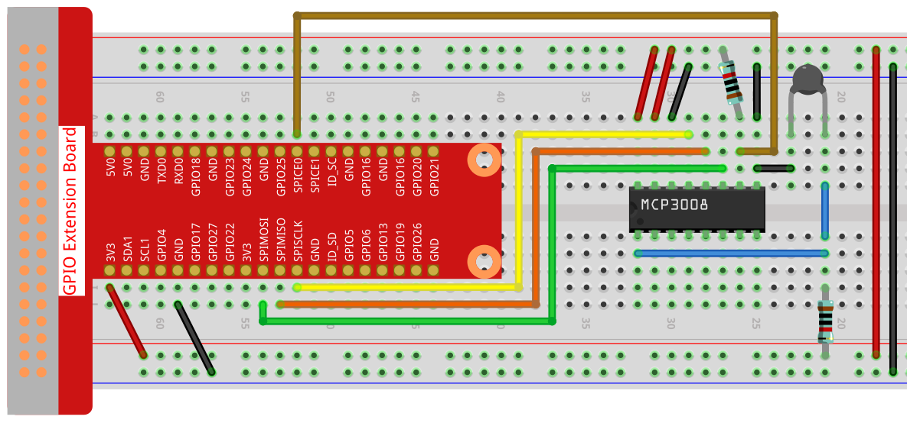

.. note::

    Hello, welcome to the SunFounder Raspberry Pi & Arduino & ESP32 Enthusiasts Community on Facebook! Dive deeper into Raspberry Pi, Arduino, and ESP32 with fellow enthusiasts.

    **Why Join?**

    - **Expert Support**: Solve post-sale issues and technical challenges with help from our community and team.
    - **Learn & Share**: Exchange tips and tutorials to enhance your skills.
    - **Exclusive Previews**: Get early access to new product announcements and sneak peeks.
    - **Special Discounts**: Enjoy exclusive discounts on our newest products.
    - **Festive Promotions and Giveaways**: Take part in giveaways and holiday promotions.

    👉 Ready to explore and create with us? Click [|link_sf_facebook|] and join today!

.. _2.2.2_py_pi5_mcp3008:

2.2.2 Thermistor(MCP3008)
============================

.. note::

   .. image:: ../img/mcp3008_and_adc0834.jpg
      :width: 25%
      :align: left
    

   Depending on your kit version, please identify whether you have **ADC0834** or **MCP3008** and proceed with the matching section.

Introduction
------------

Just like photoresistor can sense light, thermistor is a temperature
sensitive electronic device that can be used for realizing functions of
temperature control, such as making a heat alarm.

Required Components
------------------------------

In this project, we need the following components. 

.. image:: ../python_pi5/img/list2_2.2.2_thermistor.png

It's definitely convenient to buy a whole kit, here's the link: 

.. list-table::
    :widths: 20 20 20
    :header-rows: 1

    *   - Name	
        - ITEMS IN THIS KIT
        - LINK
    *   - Raphael Kit
        - 337
        - |link_Raphael_kit|

You can also buy them separately from the links below.

.. list-table::
    :widths: 30 20
    :header-rows: 1

    *   - COMPONENT INTRODUCTION
        - PURCHASE LINK

    *   - :ref:`cpn_gpio_board`
        - |link_gpio_board_buy|
    *   - :ref:`cpn_breadboard`
        - |link_breadboard_buy|
    *   - :ref:`cpn_wires`
        - |link_wires_buy|
    *   - :ref:`cpn_resistor`
        - |link_resistor_buy|
    *   - :ref:`cpn_thermistor`
        - |link_thermistor_buy|
    *   - :ref:`cpn_mcp3008`
        - \-

Schematic Diagram
-----------------

.. .. image:: ../python_pi5/img/2.2.2_thermistor_schematic_1.png

.. list-table::
    :widths: 30 30 30 30
    :header-rows: 1

    *   - T-Board Name
        - physical
        - WiringPi
        - BCM

    *   - SPICE0
        - pin24
        - 10
        - 8
    *   - SPIMOSI
        - pin19
        - 12
        - 10
    *   - SPIMISO
        - pin21
        - 13
        - 9
    *   - SPISCLK
        - pin23
        - 14
        - 11

.. image:: ../python_pi5/img/schematic_2.2.2_thermistor_mcp3008.png

Experimental Procedures
--------------------------

**Step 1:** Build the circuit.

**Step 2:** Set up the SPI interface and install the ``spidev`` library (see :ref:`spi_configuration` for detailed instructions). If you have already completed these steps, you can skip this.

**Step 3:** Go to the folder of the code.

.. raw:: html

   <run></run>

.. code-block:: 

    cd ~/raphael-kit/python-pi5

**Step 4:** Run the executable file

.. raw:: html

   <run></run>

.. code-block:: 

    sudo python3 2.2.2-2_Thermistor_zero.py

With the code run, the thermistor detects ambient temperature which will
be printed on the screen once it finishes the program calculation.

.. warning::

    If there is an error prompt  ``RuntimeError: Cannot determine SOC peripheral base address``, please refer to :ref:`faq_soc` 

**Code**

.. note::

    You can **Modify/Reset/Copy/Run/Stop** the code below. But before that, you need to go to  source code path like ``raphael-kit/python-pi5``. After modifying the code, you can run it directly to see the effect.

.. raw:: html

    <run></run>

.. code-block:: python

    #!/usr/bin/env python3
    # -*- coding: utf-8 -*-

    import spidev
    import time
    import math

    # Initialize SPI for MCP3008 (Bus 0, CE0)
    spi = spidev.SpiDev()
    spi.open(0, 0)  # Bus 0, Device 0 (CE0)
    spi.max_speed_hz = 1000000  # 1 MHz

    def read_adc(channel):
        """
        Read analog value from MCP3008 channel (0–7)
        """
        if channel < 0 or channel > 7:
            return -1
        # MCP3008 communication format
        adc = spi.xfer2([1, (8 + channel) << 4, 0])
        value = ((adc[1] & 0x03) << 8) | adc[2]
        return value

    try:
        while True:
            # Read analog value from CH0 of MCP3008
            analogVal = read_adc(0)

            # Convert to voltage (3.3V reference)
            Vr = 3.3 * analogVal / 1023.0

            # Calculate thermistor resistance
            Rt = 10000.0 * Vr / (3.3 - Vr)

            # Calculate temperature in Kelvin using the Steinhart–Hart approximation
            tempK = 1.0 / (((math.log(Rt / 10000.0)) / 3950.0) + (1.0 / (273.15 + 25.0)))

            # Convert to Celsius and Fahrenheit
            Cel = tempK - 273.15
            Fah = Cel * 1.8 + 32

            # Print the temperature
            print('Celsius: %.2f °C  Fahrenheit: %.2f °F' % (Cel, Fah))

            # Wait before next reading
            time.sleep(0.2)

    except KeyboardInterrupt:
        spi.close()

**Code Explanation**

#. This section imports the spidev module for communicating with the MCP3008 ADC via SPI, the time module for delays, and the math module for logarithmic calculations needed in temperature conversion.

   .. code-block:: python

       #!/usr/bin/env python3
       # -*- coding: utf-8 -*-

       import spidev
       import time
       import math

#. Initializes the SPI interface for MCP3008 on bus 0 and device 0 (CE0), setting the maximum SPI clock speed to 1 MHz.

   .. code-block:: python

       # Initialize SPI for MCP3008 (Bus 0, CE0)
       spi = spidev.SpiDev()
       spi.open(0, 0)  # Bus 0, Device 0 (CE0)
       spi.max_speed_hz = 1000000  # 1 MHz

#. Defines a function to read analog values from a specified MCP3008 channel (0–7). The SPI protocol is used to communicate with the MCP3008, and a 10-bit integer (0–1023) is returned.

   .. code-block:: python

       def read_adc(channel):
           """
           Read analog value from MCP3008 channel (0–7)
           """
           if channel < 0 or channel > 7:
               return -1
           # MCP3008 communication format
           adc = spi.xfer2([1, (8 + channel) << 4, 0])
           value = ((adc[1] & 0x03) << 8) | adc[2]
           return value

#. Implements a loop to continuously read analog values from a thermistor connected to CH0 of MCP3008. It converts the raw reading into a voltage (based on 3.3V reference), then into resistance, and finally into temperature using the Steinhart–Hart equation. Temperature is output in both Celsius and Fahrenheit. A short delay is inserted between readings.

   .. code-block:: python

       try:
           while True:
               # Read analog value from CH0 of MCP3008
               analogVal = read_adc(0)

               # Convert to voltage (3.3V reference)
               Vr = 3.3 * analogVal / 1023.0

               # Calculate thermistor resistance
               Rt = 10000.0 * Vr / (3.3 - Vr)

               # Calculate temperature in Kelvin using the Steinhart–Hart approximation
               tempK = 1.0 / (((math.log(Rt / 10000.0)) / 3950.0) + (1.0 / (273.15 + 25.0)))

               # Convert to Celsius and Fahrenheit
               Cel = tempK - 273.15
               Fah = Cel * 1.8 + 32

               # Print the temperature
               print('Celsius: %.2f °C  Fahrenheit: %.2f °F' % (Cel, Fah))

               # Wait before next reading
               time.sleep(0.2)

#. Captures a KeyboardInterrupt (Ctrl+C) for graceful program termination. It closes the SPI interface to release the resource.

   .. code-block:: python

       except KeyboardInterrupt:
           spi.close()
