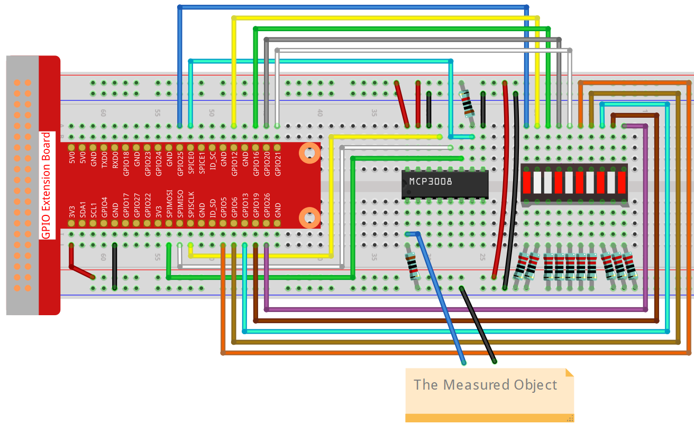

.. note::

    ¡Hola, bienvenido a la Comunidad de Entusiastas de SunFounder Raspberry Pi & Arduino & ESP32 en Facebook! Sumérgete en Raspberry Pi, Arduino y ESP32 con otros entusiastas.

    **¿Por qué unirse?**

    - **Soporte experto**: Resuelve problemas postventa y desafíos técnicos con la ayuda de nuestra comunidad y equipo.
    - **Aprender y compartir**: Intercambia consejos y tutoriales para mejorar tus habilidades.
    - **Avances exclusivos**: Obtén acceso anticipado a nuevos anuncios de productos y adelantos.
    - **Descuentos especiales**: Disfruta de descuentos exclusivos en nuestros productos más recientes.
    - **Promociones y sorteos festivos**: Participa en sorteos y promociones especiales de temporada.

    👉 ¿Listo para explorar y crear con nosotros? Haz clic en [|link_sf_facebook|] y únete hoy mismo.

.. _4.1.11_py_pi5_mcp3008:

4.1.8 Indicador de Batería (MCP3008)
====================================

.. note::

   .. image:: ../img/mcp3008_and_adc0834.jpg
      :width: 25%
      :align: left
    

   Dependiendo de la versión de tu kit, identifica si tienes **ADC0834** o **MCP3008** y procede con la sección correspondiente.

Introducción
------------

En este proyecto, haremos un dispositivo indicador de batería que puede mostrar visualmente el nivel de batería en la barra de LED.

.. warning::

    No uses componentes de batería que excedan los 3.3V para evitar sobrecargas que puedan dañar el chip o la Raspberry Pi.

Componentes requeridos
----------------------

En este proyecto, necesitamos los siguientes componentes.

.. image:: ../python_pi5/img/list2_Battery_Indicator.png
    :align: center

Es definitivamente conveniente comprar un kit completo, aquí tienes el enlace: 

.. list-table::
    :widths: 20 20 20
    :header-rows: 1

    *   - Nombre	
        - ELEMENTOS EN ESTE KIT
        - ENLACE
    *   - Kit Raphael
        - 337
        - |link_Raphael_kit|

También puedes comprarlos por separado en los enlaces siguientes.

.. list-table::
    :widths: 30 20
    :header-rows: 1

    *   - INTRODUCCIÓN DEL COMPONENTE
        - ENLACE DE COMPRA

    *   - :ref:`cpn_gpio_extension_board`
        - |link_gpio_board_buy|
    *   - :ref:`cpn_breadboard`
        - |link_breadboard_buy|
    *   - :ref:`cpn_wires`
        - |link_wires_buy|
    *   - :ref:`cpn_resistor`
        - |link_resistor_buy|
    *   - :ref:`cpn_bar_graph`
        - \-
    *   - :ref:`cpn_mcp3008`
        - \-

Diagrama esquemático
--------------------

============ ======== ======== ===
T-Board Name physical wiringPi BCM
SPICE0       Pin 24   10       8
SPIMOSI      Pin 19   12       10
SPIMISO      Pin 21   13       9
SPISCLK      Pin 23   14       11
GPIO25       Pin 22   6        25
GPIO12       Pin 32   26       12
GPIO16       Pin 36   27       16
GPIO20       Pin 38   28       20
GPIO21       Pin 40   29       21
GPIO5        Pin 29   21       5
GPIO6        Pin 31   22       6
GPIO13       Pin 33   23       13
GPIO19       Pin 35   24       19
GPIO26       Pin 37   25       26
============ ======== ======== ===

.. image:: ../python_pi5/img/schematic_battery_indicator_mcp3008.png
   :align: center
   :width: 800

Procedimientos experimentales
-----------------------------

**Paso 1:** Construye el circuito.

**Paso 2:** Configura la interfaz SPI e instala la librería ``spidev`` (consulta :ref:`spi_configuration` para instrucciones detalladas).  
Si ya completaste estos pasos, puedes omitirlos.

**Paso 3:** Ve a la carpeta del código.

.. raw:: html

    <run></run>

.. code-block::

    cd ~/raphael-kit/python-pi5

**Paso 4:** Ejecuta el archivo.

.. raw:: html

    <run></run>

.. code-block::

    sudo python3 4.1.11-2_Battery_indicator_zero.py

Después de ejecutar el programa, conecta un cable desde el pin 3 de MCP3008 y el GND, y luego conéctalos a los dos polos de una batería. Podrás ver los LEDs correspondientes en la barra de LED encenderse para mostrar el nivel de energía (rango de medición: 0-5V).

.. warning::

    Si aparece el error ``RuntimeError: Cannot determine SOC peripheral base address``, consulta :ref:`faq_soc`

Código
------

.. note::
    Puedes **Modificar/Restablecer/Copiar/Ejecutar/Detener** el código a continuación.  
    Pero antes, debes ir a la ruta del código fuente como ``raphael-kit/python-pi5``.  
    Después de modificar el código, puedes ejecutarlo directamente para ver el efecto.

.. raw:: html

    <run></run>

.. code-block:: python

    #!/usr/bin/env python3

    import LCD1602
    from gpiozero import LED, Buzzer, Button
    import spidev
    import time
    import math

    Joy_BtnPin = Button(22)  # GPIO22, Pin15
    buzzPin = Buzzer(23)     # GPIO23, Pin16
    ledPin = LED(24)         # GPIO24, Pin18

    upperTem = 40

    spi = spidev.SpiDev()
    spi.open(0, 0)
    spi.max_speed_hz = 1000000  # 1 MHz

    LCD1602.init(0x27, 1)

    def read_adc(channel):
        if channel < 0 or channel > 7:
            return -1
        adc = spi.xfer2([1, (8 + channel) << 4, 0])
        value = ((adc[1] & 0x03) << 8) | adc[2]
        return value

    def get_joystick_value():
        x_val = read_adc(1)
        y_val = read_adc(2)
        if x_val > 800:
            return 1
        elif x_val < 200:
            return -1
        elif y_val > 800:
            return -10
        elif y_val < 200:
            return 10
        else:
            return 0

    def upper_tem_setting():
        global upperTem
        LCD1602.write(0, 0, 'Upper Adjust: ')
        change = int(get_joystick_value())
        upperTem += change
        strUpperTem = str(upperTem)
        LCD1602.write(0, 1, strUpperTem)
        LCD1602.write(len(strUpperTem), 1, '              ')
        time.sleep(0.1)

    def temperature():
        analogVal = read_adc(0)
        Vr = 3.3 * analogVal / 1023.0
        if Vr == 0:
            return 0
        Rt = 10000.0 * (3.3 - Vr) / Vr
        temp = 1 / (((math.log(Rt / 10000.0)) / 3950.0) + (1 / (273.15 + 25.0)))
        Cel = temp - 273.15
        return round(Cel, 2)

    def monitoring_temp():
        global upperTem
        Cel = temperature()
        LCD1602.write(0, 0, 'Temp: ')
        LCD1602.write(0, 1, 'Upper: ')
        LCD1602.write(6, 0, str(Cel))
        LCD1602.write(7, 1, str(upperTem))
        time.sleep(0.1)
        if Cel >= upperTem:
            buzzPin.on()
            ledPin.on()
        else:
            buzzPin.off()
            ledPin.off()

    try:
        lastState = 1
        stage = 0
        while True:
            currentState = Joy_BtnPin.value
            if currentState == 1 and lastState == 0:
                stage = (stage + 1) % 2
                time.sleep(0.1)
                LCD1602.clear()
            lastState = currentState
            if stage == 1:
                upper_tem_setting()
            else:
                monitoring_temp()
    except KeyboardInterrupt:
        LCD1602.clear()
        spi.close()

Explicación del código
----------------------

Este programa de Python se ejecuta en una Raspberry Pi. Usa un convertidor analógico-digital MCP3008 para leer datos de temperatura de un sensor analógico. Un joystick se utiliza para ajustar el umbral de temperatura, y una pantalla LCD1602 muestra la temperatura actual y el umbral. Un zumbador y un LED se activan cuando la temperatura supera el umbral.

1. **Importar librerías necesarias**

   .. code-block:: python

       #!/usr/bin/env python3

       import RPi.GPIO as GPIO
       import spidev
       import time
       import math
       import LCD1602

2. **Configuración de pines GPIO**

   .. code-block:: python

       JOY_BTN_PIN = 22
       BUZZER_PIN = 23
       LED_PIN = 24

       GPIO.setmode(GPIO.BCM)
       GPIO.setup(JOY_BTN_PIN, GPIO.IN, pull_up_down=GPIO.PUD_UP)
       GPIO.setup(BUZZER_PIN, GPIO.OUT)
       GPIO.setup(LED_PIN, GPIO.OUT)

3. **Inicialización de SPI y LCD**

   .. code-block:: python

       upperTem = 40
       spi = spidev.SpiDev()
       spi.open(0, 0)
       spi.max_speed_hz = 1000000
       LCD1602.init(0x27, 1)

4. **Lectura de canal ADC**

   .. code-block:: python

       def read_adc(channel):
           if channel < 0 or channel > 7:
               return -1
           adc = spi.xfer2([1, (8 + channel) << 4, 0])
           value = ((adc[1] & 0x03) << 8) | adc[2]
           return value

5. **Entrada de dirección del joystick**

   .. code-block:: python

       def get_joystick_value():
           x_val = read_adc(1)
           y_val = read_adc(2)
           if x_val > 800:
               return 1
           elif x_val < 200:
               return -1
           elif y_val > 800:
               return -10
           elif y_val < 200:
               return 10
           else:
               return 0

6. **Ajuste del umbral de temperatura**

   .. code-block:: python

       def upper_tem_setting():
           global upperTem
           LCD1602.write(0, 0, 'Upper Adjust: ')
           change = int(get_joystick_value())
           upperTem += change
           strUpperTem = str(upperTem)
           LCD1602.write(0, 1, strUpperTem)
           LCD1602.write(len(strUpperTem), 1, '              ')
           time.sleep(0.1)

7. **Cálculo de temperatura desde el sensor analógico**

   .. code-block:: python

       def temperature():
           analogVal = read_adc(0)
           Vr = 3.3 * analogVal / 1023.0
           if Vr == 0:
               return 0
           Rt = 10000.0 * (3.3 - Vr) / Vr
           tempK = 1.0 / (((math.log(Rt / 10000.0)) / 3950.0) + (1.0 / (273.15 + 25.0)))
           Cel = tempK - 273.15
           return round(Cel, 2)

8. **Modo de monitoreo**

   .. code-block:: python

       def monitoring_temp():
           global upperTem
           Cel = temperature()
           LCD1602.write(0, 0, 'Temp: ')
           LCD1602.write(0, 1, 'Upper: ')
           LCD1602.write(6, 0, str(Cel))
           LCD1602.write(7, 1, str(upperTem))
           time.sleep(0.1)
           if Cel >= upperTem:
               GPIO.output(BUZZER_PIN, GPIO.HIGH)
               GPIO.output(LED_PIN, GPIO.HIGH)
           else:
               GPIO.output(BUZZER_PIN, GPIO.LOW)
               GPIO.output(LED_PIN, GPIO.LOW)

9. **Bucle principal**

   .. code-block:: python

       try:
           lastState = GPIO.input(JOY_BTN_PIN)
           stage = 0
           while True:
               currentState = GPIO.input(JOY_BTN_PIN)
               if currentState == GPIO.HIGH and lastState == GPIO.LOW:
                   stage = (stage + 1) % 2
                   time.sleep(0.1)
                   LCD1602.clear()
               lastState = currentState
               if stage == 1:
                   upper_tem_setting()
               else:
                   monitoring_temp()

10. **Limpieza al salir**

   .. code-block:: python

       except KeyboardInterrupt:
           pass

       finally:
           LCD1602.clear()
           GPIO.cleanup()
           spi.close()
