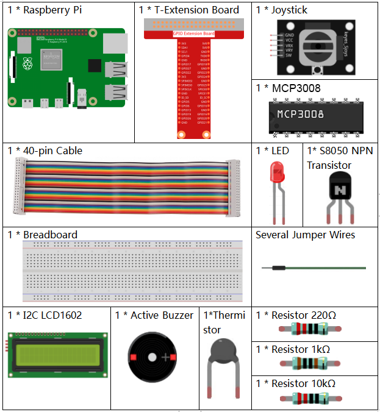
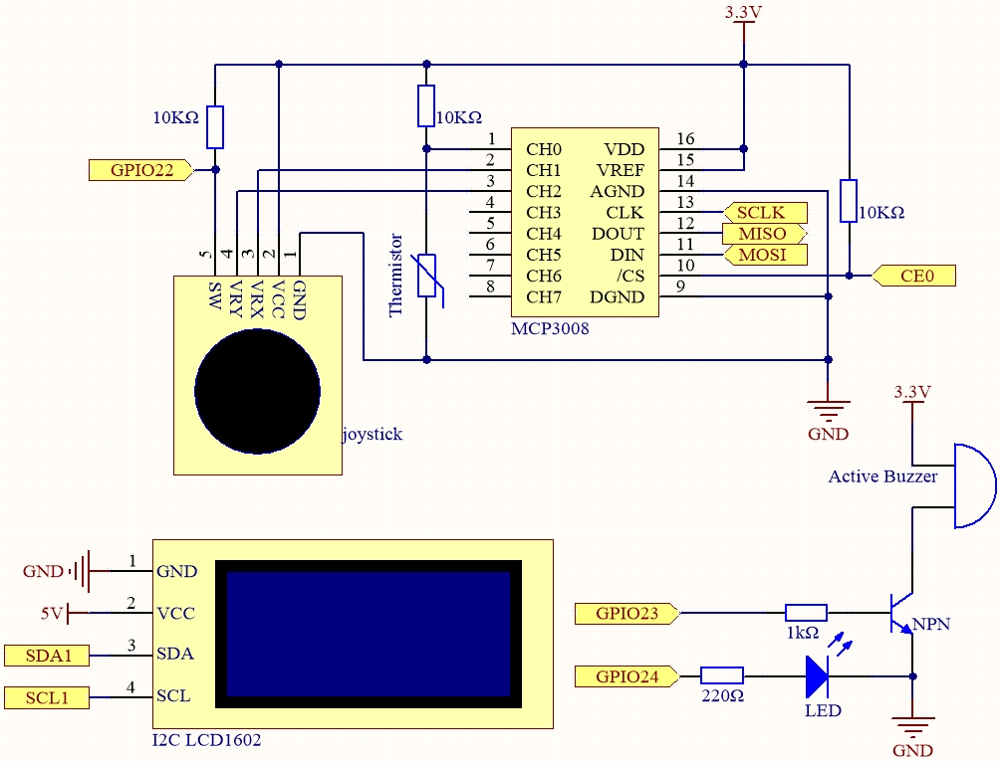
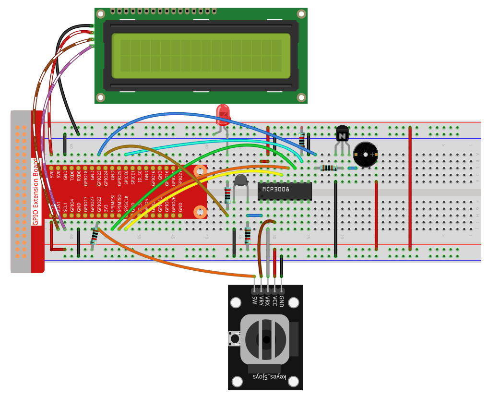

.. note::

    Hello, welcome to the SunFounder Raspberry Pi & Arduino & ESP32 Enthusiasts Community on Facebook! Dive deeper into Raspberry Pi, Arduino, and ESP32 with fellow enthusiasts.

    **Why Join?**

    - **Expert Support**: Solve post-sale issues and technical challenges with help from our community and team.
    - **Learn & Share**: Exchange tips and tutorials to enhance your skills.
    - **Exclusive Previews**: Get early access to new product announcements and sneak peeks.
    - **Special Discounts**: Enjoy exclusive discounts on our newest products.
    - **Festive Promotions and Giveaways**: Take part in giveaways and holiday promotions.

    👉 Ready to explore and create with us? Click [|link_sf_facebook|] and join today!

.. _4.1.13_py_pi5_mcp3008:

4.1.10 Overheat Monitor(MCP3008)
=====================================

.. note::

   .. image:: ../img/mcp3008_and_adc0834.jpg
      :width: 25%
      :align: left
    

   Depending on your kit version, please identify whether you have **ADC0834** or **MCP3008** and proceed with the matching section.

Introduction
-------------------

You may want to make an overheat monitoring device that applies to
various situations, ex., in the factory, if we want to have an alarm and
the timely automatic turning off of the machine when there is a circuit
overheating. In this project, we will use thermistor, joystick, buzzer,
LED and LCD to make an smart temperature monitoring device whose
threshold is adjustable.

Required Components
------------------------------

In this project, we need the following components.

It's definitely convenient to buy a whole kit, here's the link: 

.. list-table::
    :widths: 20 20 20
    :header-rows: 1

    *   - Name	
        - ITEMS IN THIS KIT
        - LINK
    *   - Raphael Kit
        - 337
        - |link_Raphael_kit|

You can also buy them separately from the links below.

.. list-table::
    :widths: 30 20
    :header-rows: 1

    *   - COMPONENT INTRODUCTION
        - PURCHASE LINK

    *   - :ref:`cpn_gpio_extension_board`
        - |link_gpio_board_buy|
    *   - :ref:`cpn_breadboard`
        - |link_breadboard_buy|
    *   - :ref:`cpn_wires`
        - |link_wires_buy|
    *   - :ref:`cpn_resistor`
        - |link_resistor_buy|
    *   - :ref:`cpn_led`
        - |link_led_buy|
    *   - :ref:`cpn_joystick`
        - \-
    *   - :ref:`cpn_mcp3008`
        - \-
    *   - :ref:`cpn_transistor`
        - |link_transistor_buy|
    *   - :ref:`cpn_i2c_lcd`
        - |link_i2clcd1602_buy|
    *   - :ref:`cpn_thermistor`
        - |link_thermistor_buy|
    *   - :ref:`cpn_buzzer`
        - \-

Schematic Diagram
--------------------------

============ ======== ======== ===
T-Board Name physical wiringPi BCM
SPICE0       Pin 24   10       8
SPIMOSI      Pin 19   12       10
SPIMISO      Pin 21   13       9
SPISCLK      Pin 23   14       11
GPIO22       Pin15    3        22
GPIO23       Pin16    4        23
GPIO24       Pin18    5        24
SDA1         Pin 3             
SCL1         Pin 5             
============ ======== ======== ===

Experimental Procedures
-----------------------------

**Step 1:** Build the circuit.

**Step 2:** Set up the SPI interface and install the ``spidev`` library (see :ref:`spi_configuration` for detailed instructions). If you have already completed these steps, you can skip this.

**Step 3**: Go to the folder of the code.

.. raw:: html

   <run></run>

.. code-block:: 

    cd ~/raphael-kit/python-pi5

**Step 4**: Run the executable file.

.. raw:: html

   <run></run>

.. code-block:: 

    sudo python3 4.1.13-2_OverheatMonitor_zero.py

As the code runs, the current temperature and the high-temperature
threshold **40** are displayed on **I2C LCD1602**. If the current
temperature is larger than the threshold, the buzzer and LED are started
to alarm you.

**Joystick** here is for your pressing to adjust the high-temperature
threshold. Toggling the **Joystick** in the direction of X-axis and
Y-axis can adjust (turn up or down) the current high-temperature
threshold. Press the **Joystick** once again to reset the threshold to
initial value.

.. note::

    * If you get the error ``FileNotFoundError: [Errno 2] No such file or directory: '/dev/i2c-1'``, you need to refer to :ref:`i2c_config` to enable the I2C.
    * If you get ``ModuleNotFoundError: No module named 'smbus2'`` error, please run ``sudo pip3 install smbus2``.
    * If the error ``OSError: [Errno 121] Remote I/O error`` appears, it means the module is miswired or the module is broken.
    * If the code and wiring are fine, but the LCD still does not display content, you can turn the potentiometer on the back to increase the contrast.

.. warning::

    If there is an error prompt  ``RuntimeError: Cannot determine SOC peripheral base address``, please refer to :ref:`faq_soc` 

**Code**

.. note::
    You can **Modify/Reset/Copy/Run/Stop** the code below. But before that, you need to go to  source code path like ``raphael-kit/python``. After modifying the code, you can run it directly to see the effect.

.. raw:: html

    <run></run>

.. code-block:: python

    #!/usr/bin/env python3

    import LCD1602
    from gpiozero import LED, Buzzer, Button
    import spidev
    import time
    import math

    # Initialize joystick button, buzzer, and LED
    Joy_BtnPin = Button(22)  # GPIO22, Pin15
    buzzPin = Buzzer(23)     # GPIO23, Pin16
    ledPin = LED(24)         # GPIO24, Pin18

    # Set initial upper temperature threshold
    upperTem = 40

    # Initialize SPI for MCP3008 (Bus 0, CE0 -> GPIO8 / Pin24)
    spi = spidev.SpiDev()
    spi.open(0, 0)
    spi.max_speed_hz = 1000000  # 1 MHz

    # Initialize LCD (I2C address 0x27, backlight on)
    LCD1602.init(0x27, 1)

    def read_adc(channel):
        """
        Read analog value from MCP3008 (0–7)
        """
        if channel < 0 or channel > 7:
            return -1
        adc = spi.xfer2([1, (8 + channel) << 4, 0])
        value = ((adc[1] & 0x03) << 8) | adc[2]
        return value

    def get_joystick_value():
        """
        Reads the joystick values and returns a change value based on the joystick's position.
        """
        x_val = read_adc(1)
        y_val = read_adc(2)
        if x_val > 800:
            return 1
        elif x_val < 200:
            return -1
        elif y_val > 800:
            return -10
        elif y_val < 200:
            return 10
        else:
            return 0

    def upper_tem_setting():
        """
        Adjusts and displays the upper temperature threshold on the LCD.
        """
        global upperTem
        LCD1602.write(0, 0, 'Upper Adjust: ')
        change = int(get_joystick_value())
        upperTem += change
        strUpperTem = str(upperTem)
        LCD1602.write(0, 1, strUpperTem)
        LCD1602.write(len(strUpperTem), 1, '              ')
        time.sleep(0.1)

    def temperature():
        """
        Reads the current temperature from the sensor and returns it in Celsius.
        """
        analogVal = read_adc(0)
        Vr = 3.3 * analogVal / 1023.0  # Voltage across the fixed resistor
        if Vr == 0:
            return 0  # Prevent division by zero
        Rt = 10000.0 * Vr / (3.3 - Vr)  # Adjusted formula: thermistor voltage is (3.3 - Vr)
        temp = 1 / (((math.log(Rt / 10000.0)) / 3950.0) + (1 / (273.15 + 25.0)))
        Cel = temp - 273.15
        return round(Cel, 2)

    def monitoring_temp():
        """
        Monitors and displays the current temperature and upper temperature threshold. 
        Activates buzzer and LED if the temperature exceeds the upper limit.
        """
        global upperTem
        Cel = temperature()
        LCD1602.write(0, 0, 'Temp: ')
        LCD1602.write(0, 1, 'Upper: ')
        LCD1602.write(6, 0, str(Cel))
        LCD1602.write(7, 1, str(upperTem))
        time.sleep(0.1)
        if Cel >= upperTem:
            buzzPin.on()
            ledPin.on()
        else:
            buzzPin.off()
            ledPin.off()

    # Main execution loop
    try:
        lastState = 1
        stage = 0
        while True:
            currentState = Joy_BtnPin.value
            if currentState == 1 and lastState == 0:
                stage = (stage + 1) % 2
                time.sleep(0.1)
                LCD1602.clear()
            lastState = currentState
            if stage == 1:
                upper_tem_setting()
            else:
                monitoring_temp()
    except KeyboardInterrupt:
        LCD1602.clear()
        spi.close()

Code Explanation
-------------------

#. This section imports the required libraries. ``LCD1602`` is for LCD display via I2C, ``gpiozero`` provides support for the LED, Buzzer, and Button, ``spidev`` is used to communicate with the MCP3008 ADC, and standard ``time`` and ``math`` libraries are used for delays and temperature calculations.

   .. code-block:: python

       #!/usr/bin/env python3

       import LCD1602
       from gpiozero import LED, Buzzer, Button
       import spidev
       import time
       import math

#. Initializes hardware components connected to GPIO pins:

   * ``Button(22)`` connects to the joystick button.
   * ``Buzzer(23)`` and ``LED(24)`` serve as output indicators for high temperature.

   .. code-block:: python

       Joy_BtnPin = Button(22)  # GPIO22, Pin15
       buzzPin = Buzzer(23)     # GPIO23, Pin16
       ledPin = LED(24)         # GPIO24, Pin18

#. Sets the default upper temperature threshold and initializes both SPI for MCP3008 and the LCD1602 display.

   .. code-block:: python

       upperTem = 40

       spi = spidev.SpiDev()
       spi.open(0, 0)
       spi.max_speed_hz = 1000000

       LCD1602.init(0x27, 1)

#. This function reads the analog value from a specified channel (0–7) on the MCP3008 using SPI protocol and returns a 10-bit value.

   .. code-block:: python

       def read_adc(channel):
           if channel < 0 or channel > 7:
               return -1
           adc = spi.xfer2([1, (8 + channel) << 4, 0])
           value = ((adc[1] & 0x03) << 8) | adc[2]
           return value

#. The joystick’s position is evaluated by reading channels 1 and 2 of the MCP3008. Depending on X or Y direction, different values are returned for threshold adjustments.

   .. code-block:: python

       def get_joystick_value():
           x_val = read_adc(1)
           y_val = read_adc(2)
           if x_val > 800:
               return 1
           elif x_val < 200:
               return -1
           elif y_val > 800:
               return -10
           elif y_val < 200:
               return 10
           else:
               return 0

#. Adjusts the upper temperature threshold using the joystick. Displays the current threshold on the LCD and ensures clean formatting.

   .. code-block:: python

       def upper_tem_setting():
           global upperTem
           LCD1602.write(0, 0, 'Upper Adjust: ')
           change = int(get_joystick_value())
           upperTem += change
           strUpperTem = str(upperTem)
           LCD1602.write(0, 1, strUpperTem)
           LCD1602.write(len(strUpperTem), 1, '              ')
           time.sleep(0.1)

#. This function reads the analog value from MCP3008 channel 0 (connected to a thermistor), calculates voltage, resistance, and ultimately the temperature in Celsius using the Steinhart–Hart approximation.

   .. code-block:: python

    def temperature():
        """
        Reads the current temperature from the sensor and returns it in Celsius.
        """
        analogVal = read_adc(0)
        Vr = 3.3 * analogVal / 1023.0  # Voltage across the fixed resistor
        if Vr == 0:
            return 0  # Prevent division by zero
        Rt = 10000.0 * Vr / (3.3 - Vr)  # Adjusted formula: thermistor voltage is (3.3 - Vr)
        temp = 1 / (((math.log(Rt / 10000.0)) / 3950.0) + (1 / (273.15 + 25.0)))
        Cel = temp - 273.15
        return round(Cel, 2)

#. Continuously reads the current temperature, compares it with the upper threshold, and displays both on the LCD. If the temperature exceeds the threshold, the buzzer and LED are turned on.

   .. code-block:: python

       def monitoring_temp():
           global upperTem
           Cel = temperature()
           LCD1602.write(0, 0, 'Temp: ')
           LCD1602.write(0, 1, 'Upper: ')
           LCD1602.write(6, 0, str(Cel))
           LCD1602.write(7, 1, str(upperTem))
           time.sleep(0.1)
           if Cel >= upperTem:
               buzzPin.on()
               ledPin.on()
           else:
               buzzPin.off()
               ledPin.off()

#. The main execution loop alternates between setting mode and monitoring mode using a joystick button. A press toggles the mode. In setting mode, the upper threshold is adjusted; in monitoring mode, temperature is continuously checked.

   .. code-block:: python

       try:
           lastState = 1
           stage = 0
           while True:
               currentState = Joy_BtnPin.value
               if currentState == 1 and lastState == 0:
                   stage = (stage + 1) % 2
                   time.sleep(0.1)
                   LCD1602.clear()
               lastState = currentState
               if stage == 1:
                   upper_tem_setting()
               else:
                   monitoring_temp()

#. Ensures that the LCD is cleared and SPI communication is properly closed when the program exits via keyboard interruption.

   .. code-block:: python

       except KeyboardInterrupt:
           LCD1602.clear()
           spi.close()
