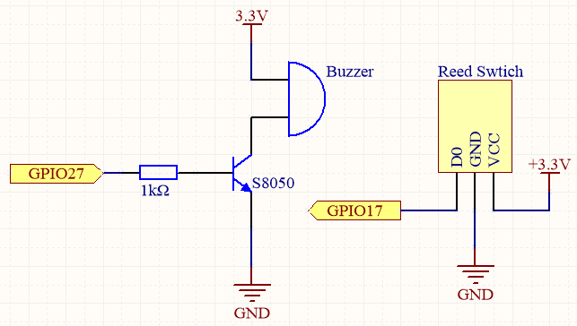
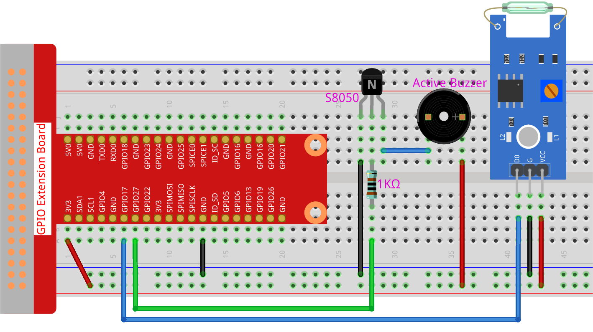

.. _4.1.6_py_pi5:

4.1.3 Magnetic Induction Alarm System
============================================

Introduction
-----------------

When you get a precious vase, you can make a magnetic induction alarm system for it, no matter who moves it, you can hear the alarm in time.

Required Components
------------------------------

In this project, we need the following components.

.. image:: ../python_pi5/img/4.1.6_magneticalarmsystem_list.png
  :width: 800
  :align: center

It's definitely convenient to buy a whole kit, here's the link: 

.. list-table::
    :widths: 20 20 20
    :header-rows: 1

    *   - Name	
        - ITEMS IN THIS KIT
        - LINK
    *   - Raphael Kit
        - 337
        - |link_Raphael_kit|

You can also buy them separately from the links below.

.. list-table::
    :widths: 30 20
    :header-rows: 1

    *   - COMPONENT INTRODUCTION
        - PURCHASE LINK

    *   - :ref:`gpio_extension_board`
        - |link_gpio_board_buy|
    *   - :ref:`breadboard`
        - |link_breadboard_buy|
    *   - :ref:`wires`
        - |link_wires_buy|
    *   - :ref:`resistor`
        - |link_resistor_buy|
    *   - :ref:`Buzzer`
        - |link_passive_buzzer_buy|
    *   - :ref:`transistor`
        - |link_transistor_buy|
    *   - :ref:`reed_switch`
        - |link_reed_switch_buy|

Schematic Diagram
-----------------------

============ ======== ======== ===
T-Board Name physical wiringPi BCM
GPIO17       Pin 11   0        17
GPIO27       Pin 13   2        27
============ ======== ======== ===

Experimental Procedures
------------------------------

**Step 1:** Build the circuit.

**Step 2:** Get into the folder of the code.

.. raw:: html

   <run></run>

.. code-block::

    cd ~/raphael-kit/python-pi5

**Step 3:** Run.

.. raw:: html

   <run></run>

.. code-block::

    sudo python3 4.1.6_MagneticAlarmSystem_zero.py

If the reed switch is affected by the magnet (for example, the reed switch is placed on the base and the magnet is placed in the vase), the object is safe. At this time, the reed switch is in the closed state, and the buzzer is silent.
After removing the magnet (such as the vase being stolen), the reed switch is not affected by the magnetic, the switch opens, and the buzzer sounds an alarm.

**Code**

.. note::
    You can **Modify/Reset/Copy/Run/Stop** the code below. But before that, you need to go to  source code path like ``raphael-kit/python-pi5``. After modifying the code, you can run it directly to see the effect.

.. raw:: html

    <run></run>

.. code-block:: python

   #!/usr/bin/env python3
   from gpiozero import Buzzer, Button
   import time

   # Initialize the buzzer on GPIO pin 27
   buzzer = Buzzer(27)
   # Initialize the reed switch on GPIO pin 17 with pull-up resistor enabled
   reed_switch = Button(17, pull_up=True)

   try:
       while True:
           # Check if the reed switch is pressed
           if reed_switch.is_pressed:
               # Turn off the buzzer if reed switch is pressed
               buzzer.off()
           else:
               # If reed switch is not pressed, beep the buzzer
               buzzer.on()
               time.sleep(0.1)  # Buzzer on for 0.1 seconds
               buzzer.off()
               time.sleep(0.1)  # Buzzer off for 0.1 seconds

   except KeyboardInterrupt:
       # Turn off the buzzer when the program is interrupted (e.g., keyboard interrupt)
       buzzer.off()
       pass

**Code Explanation**

#. This imports the necessary classes ``Buzzer`` and ``Button`` from the ``gpiozero`` library, and the ``time`` module from Python's standard library.

   .. code-block:: python

       #!/usr/bin/env python3
       from gpiozero import Buzzer, Button
       import time

#. The ``Buzzer`` object is linked to GPIO pin 27, and a ``Button`` (acting as a reed switch) is connected to GPIO pin 17 with the ``pull_up=True`` argument, enabling the internal pull-up resistor.

   .. code-block:: python

       # Initialize the buzzer on GPIO pin 27
       buzzer = Buzzer(27)
       # Initialize the reed switch on GPIO pin 17 with pull-up resistor enabled
       reed_switch = Button(17, pull_up=True)

#. The ``try`` block contains an infinite loop (``while True``) checking the state of the reed switch. If pressed (``is_pressed``), the buzzer is turned off. Otherwise, the buzzer beeps (0.1 seconds on, 0.1 seconds off). 

   .. code-block:: python

       try:
           while True:
               # Check if the reed switch is pressed
               if reed_switch.is_pressed:
                   # Turn off the buzzer if reed switch is pressed
                   buzzer.off()
               else:
                   # If reed switch is not pressed, beep the buzzer
                   buzzer.on()
                   time.sleep(0.1)  # Buzzer on for 0.1 seconds
                   buzzer.off()
                   time.sleep(0.1)  # Buzzer off for 0.1 seconds

#. The ``except`` block handles a KeyboardInterrupt (like a Ctrl+C in the terminal) to turn off the buzzer safely.

   .. code-block:: python

       except KeyboardInterrupt:
           # Turn off the buzzer when the program is interrupted (e.g., keyboard interrupt)
           buzzer.off()
           pass
