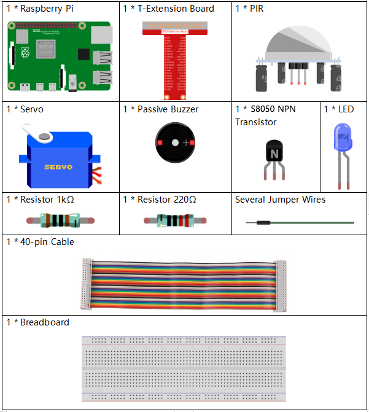
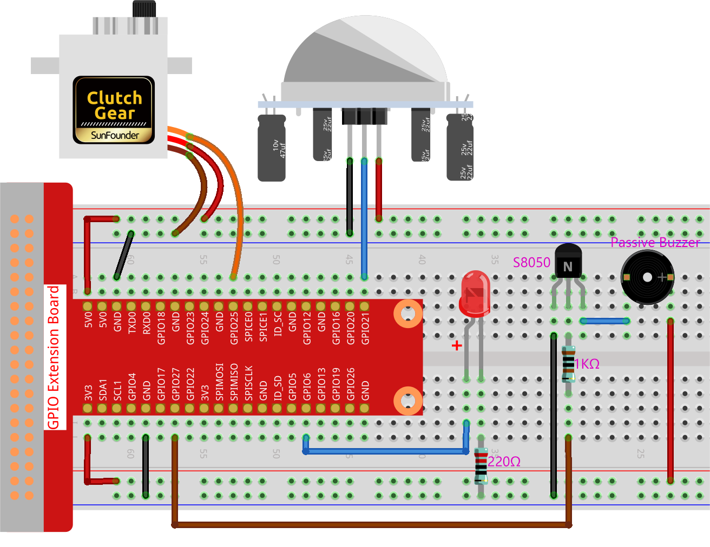

.. note::

    Hallo und willkommen in der SunFounder Raspberry Pi & Arduino & ESP32 Enthusiasten-Gemeinschaft auf Facebook! Tauchen Sie tiefer ein in die Welt von Raspberry Pi, Arduino und ESP32 mit anderen Enthusiasten.

    **Warum beitreten?**

    - **Expertenunterstützung**: Lösen Sie Nachverkaufsprobleme und technische Herausforderungen mit Hilfe unserer Gemeinschaft und unseres Teams.
    - **Lernen & Teilen**: Tauschen Sie Tipps und Anleitungen aus, um Ihre Fähigkeiten zu verbessern.
    - **Exklusive Vorschauen**: Erhalten Sie frühzeitigen Zugang zu neuen Produktankündigungen und exklusiven Einblicken.
    - **Spezialrabatte**: Genießen Sie exklusive Rabatte auf unsere neuesten Produkte.
    - **Festliche Aktionen und Gewinnspiele**: Nehmen Sie an Gewinnspielen und Feiertagsaktionen teil.

    👉 Sind Sie bereit, mit uns zu erkunden und zu erschaffen? Klicken Sie auf [|link_sf_facebook|] und treten Sie heute bei!

.. _4.1.8_py_pi5:

4.1.5 Willkommen
=====================================

Einführung
-------------

In diesem Projekt verwenden wir einen PIR-Sensor, um die Bewegung von Fußgängern zu erfassen, und nutzen Servomotoren, LED und Summer, um die Funktion der Sensortür eines Convenience-Stores zu simulieren. Wenn der Fußgänger innerhalb des Erfassungsbereichs des PIR erscheint, leuchtet die Anzeige auf, die Tür öffnet sich, und der Summer spielt die Öffnungsglocke.

Benötigte Komponenten
------------------------------

Für dieses Projekt benötigen wir folgende Komponenten.

Es ist definitiv praktisch, ein ganzes Kit zu kaufen, hier ist der Link:

.. list-table::
    :widths: 20 20 20
    :header-rows: 1

    *   - Name	
        - ARTIKEL IN DIESEM KIT
        - LINK
    *   - Raphael Kit
        - 337
        - |link_Raphael_kit|

Sie können diese auch separat über die untenstehenden Links kaufen.

.. list-table::
    :widths: 30 20
    :header-rows: 1

    *   - KOMPONENTENVORSTELLUNG
        - KAUF-LINK

    *   - :ref:`cpn_gpio_board`
        - |link_gpio_board_buy|
    *   - :ref:`cpn_breadboard`
        - |link_breadboard_buy|
    *   - :ref:`cpn_wires`
        - |link_wires_buy|
    *   - :ref:`cpn_resistor`
        - |link_resistor_buy|
    *   - :ref:`cpn_led`
        - |link_led_buy|
    *   - :ref:`cpn_pir`
        - \-
    *   - :ref:`cpn_servo`
        - |link_servo_buy|
    *   - :ref:`cpn_Buzzer`
        - |link_passive_buzzer_buy|
    *   - :ref:`cpn_transistor`
        - |link_transistor_buy|

Schaltplan
-------------------

============ ======== ======== ===
T-Board Name physical wiringPi BCM
GPIO18       Pin 12   1        18
GPIO17       Pin 11   0        17
GPIO27       Pin 13   2        27
GPIO22       Pin 15   3        22
============ ======== ======== ===

.. image:: ../python_pi5/img/4.1.8_welcome_schematic.png
   :align: center

Experimentelle Verfahren
---------------------------

**Schritt 1:** Bauen Sie den Schaltkreis.

**Schritt 2:** Wechseln Sie in das Verzeichnis.

.. raw:: html

   <run></run>

.. code-block::

    cd ~/raphael-kit/python-pi5

**Schritt 3:** Ausführen.

.. raw:: html

   <run></run>

.. code-block::

    sudo python3 4.1.8_Welcome_zero.py

Nachdem der Code ausgeführt wurde, öffnet sich die Tür automatisch (simuliert durch den Servomotor), schaltet den Indikator ein und spielt die Türklingelmusik, wenn der PIR-Sensor jemanden vorbeigehen erkennt. Nachdem die Türklingelmusik abgespielt wurde, schließt das System automatisch die Tür und schaltet das Indikatorlicht aus und wartet auf das nächste Vorbeigehen.

Es gibt zwei Potentiometer am PIR-Modul: eines zur Einstellung der Empfindlichkeit und das andere zur Einstellung der Erkennungsdistanz. Um das PIR-Modul besser zu nutzen, sollten Sie beide gegen den Uhrzeigersinn bis zum Anschlag drehen.

.. image:: ../python_pi5/img/4.1.8_PIR_TTE.png
    :width: 400
    :align: center

**Code**

.. note::
    Sie können den untenstehenden Code **modifizieren/zurücksetzen/kopieren/ausführen/stoppen**. Bevor Sie dies tun, müssen Sie zum Quellcodepfad wie ``raphael-kit/python-pi5`` gehen. Nach der Änderung des Codes können Sie ihn direkt ausführen, um die Auswirkung zu sehen.

.. raw:: html

    <run></run>

.. code-block:: python

   #!/usr/bin/env python3

   from gpiozero import LED, MotionSensor, Servo, TonalBuzzer
   import time

   # GPIO pin setup for LED, motion sensor (PIR), and buzzer
   ledPin = LED(6)
   pirPin = MotionSensor(21)
   buzPin = TonalBuzzer(27)

   # Servo motor pulse width correction factor and calculation
   myCorrection = 0.45
   maxPW = (2.0 + myCorrection) / 1000  # Maximum pulse width
   minPW = (1.0 - myCorrection) / 1000  # Minimum pulse width

   # Initialize servo with custom pulse widths
   servoPin = Servo(25, min_pulse_width=minPW, max_pulse_width=maxPW)

   # Musical tune for buzzer, with notes and durations
   tune = [('C#4', 0.2), ('D4', 0.2), (None, 0.2),
           ('Eb4', 0.2), ('E4', 0.2), (None, 0.6),
           ('F#4', 0.2), ('G4', 0.2), (None, 0.6),
           ('Eb4', 0.2), ('E4', 0.2), (None, 0.2),
           ('F#4', 0.2), ('G4', 0.2), (None, 0.2),
           ('C4', 0.2), ('B4', 0.2), (None, 0.2),
           ('F#4', 0.2), ('G4', 0.2), (None, 0.2),
           ('B4', 0.2), ('Bb4', 0.5), (None, 0.6),
           ('A4', 0.2), ('G4', 0.2), ('E4', 0.2), 
           ('D4', 0.2), ('E4', 0.2)]

   def setAngle(angle):
       """
       Move the servo to a specified angle.
       :param angle: Angle in degrees (0-180).
       """
       value = float(angle / 180)  # Convert angle to servo value
       servoPin.value = value      # Set servo position
       time.sleep(0.001)           # Short delay for servo movement

   def doorbell():
       """
       Play a musical tune using the buzzer.
       """
       for note, duration in tune:
           buzPin.play(note)       # Play the note
           time.sleep(float(duration))  # Duration of the note
       buzPin.stop()               # Stop buzzer after playing the tune

   def closedoor():
       # Turn off LED and move servo to close door
       ledPin.off()
       for i in range(180, -1, -1):
           setAngle(i)             # Move servo from 180 to 0 degrees
           time.sleep(0.001)       # Short delay for smooth movement
       time.sleep(1)               # Wait after closing door

   def opendoor():
       # Turn on LED, open door (move servo), play tune, close door
       ledPin.on()
       for i in range(0, 181):
           setAngle(i)             # Move servo from 0 to 180 degrees
           time.sleep(0.001)       # Short delay for smooth movement
       time.sleep(1)               # Wait before playing the tune
       doorbell()                  # Play the doorbell tune
       closedoor()                 # Close the door after the tune

   def loop():
       # Main loop to check for motion and operate door
       while True:
           if pirPin.motion_detected:
               opendoor()               # Open door if motion detected
           time.sleep(0.1)              # Short delay in loop

   try:
       loop()
   except KeyboardInterrupt:
       # Clean up GPIO on user interrupt (e.g., Ctrl+C)
       buzPin.stop()
       ledPin.off()

**Code-Erklärung**

#. Das Skript beginnt mit dem Import der notwendigen Module. Die Bibliothek ``gpiozero`` wird verwendet, um mit der LED, dem Bewegungssensor, dem Servomotor und dem tonalen Summer zu interagieren. Das Modul ``time`` dient zur Handhabung von zeitbezogenen Funktionen.

   .. code-block:: python

       #!/usr/bin/env python3
       from gpiozero import LED, MotionSensor, Servo, TonalBuzzer
       import time

#. Initialisiert die LED, den PIR-Bewegungssensor und den tonalen Summer an ihren jeweiligen GPIO-Pins.

   .. code-block:: python

       # GPIO pin setup for LED, motion sensor (PIR), and buzzer
       ledPin = LED(6)
       pirPin = MotionSensor(21)
       buzPin = TonalBuzzer(27)

#. Berechnet die maximalen und minimalen Pulsbreiten für den Servomotor unter Berücksichtigung eines Korrekturfaktors zur Feinabstimmung.

   .. code-block:: python

       # Servo motor pulse width correction factor and calculation
       myCorrection = 0.45
       maxPW = (2.0 + myCorrection) / 1000  # Maximum pulse width
       minPW = (1.0 - myCorrection) / 1000  # Minimum pulse width

#. Initialisiert den Servomotor am GPIO-Pin 25 mit den benutzerdefinierten Pulsbreiten für eine genaue Positionierung.

   .. code-block:: python

       # Initialize servo with custom pulse widths
       servoPin = Servo(25, min_pulse_width=minPW, max_pulse_width=maxPW)

#. Die Melodie ist als eine Abfolge von Noten (Frequenz) und Dauern (Sekunden) definiert.

   .. code-block:: python

       # Musical tune for buzzer, with notes and durations
       tune = [('C#4', 0.2), ('D4', 0.2), (None, 0.2),
               ('Eb4', 0.2), ('E4', 0.2), (None, 0.6),
               ('F#4', 0.2), ('G4', 0.2), (None, 0.6),
               ('Eb4', 0.2), ('E4', 0.2), (None, 0.2),
               ('F#4', 0.2), ('G4', 0.2), (None, 0.2),
               ('C4', 0.2), ('B4', 0.2), (None, 0.2),
               ('F#4', 0.2), ('G4', 0.2), (None, 0.2),
               ('B4', 0.2), ('Bb4', 0.5), (None, 0.6),
               ('A4', 0.2), ('G4', 0.2), ('E4', 0.2), 
               ('D4', 0.2), ('E4', 0.2)]

#. Funktion zum Bewegen des Servos zu einem bestimmten Winkel. Konvertiert den Winkel in einen Wert zwischen 0 und 1 für den Servo.

   .. code-block:: python

       def setAngle(angle):
           """
           Move the servo to a specified angle.
           :param angle: Angle in degrees (0-180).
           """
           value = float(angle / 180)  # Convert angle to servo value
           servoPin.value = value      # Set servo position
           time.sleep(0.001)           # Short delay for servo movement

#. Funktion zum Abspielen einer musikalischen Melodie mit dem Summer. Iteriert durch die Liste ``tune``, indem jede Note für ihre angegebene Dauer gespielt wird.

   .. code-block:: python

       def doorbell():
           """
           Play a musical tune using the buzzer.
           """
           for note, duration in tune:
               buzPin.play(note)       # Play the note
               time.sleep(float(duration))  # Duration of the note
           buzPin.stop()               # Stop buzzer after playing the tune

#. Funktionen zum Öffnen und Schließen der Tür mit dem Servomotor. Die Funktion ``opendoor`` schaltet die LED ein, öffnet die Tür, spielt die Melodie und schließt dann die Tür.

   .. code-block:: python

       def closedoor():
           # Turn off LED and move servo to close door
           ledPin.off()
           for i in range(180, -1, -1):
               setAngle(i)             # Move servo from 180 to 0 degrees
               time.sleep(0.001)       # Short delay for smooth movement
           time.sleep(1)               # Wait after closing door

       def opendoor():
           # Turn on LED, open door (move servo), play tune, close door
           ledPin.on()
           for i in range(0, 181):
               setAngle(i)             # Move servo from 0 to 180 degrees
               time.sleep(0.001)       # Short delay for smooth movement
           time.sleep(1)               # Wait before playing the tune
           doorbell()                  # Play the doorbell tune
           closedoor()                 # Close the door after the tune

#. Hauptprogrammschleife, die ständig auf Bewegungserkennung prüft. Wenn Bewegung erkannt wird, wird die Funktion ``opendoor`` ausgelöst.

   .. code-block:: python

       def loop():
           # Main loop to check for motion and operate door
           while True:
               if pirPin.motion_detected:
                   opendoor()               # Open door if motion detected
               time.sleep(0.1)              # Short delay in loop

#. Führt die Hauptschleife aus und stellt sicher, dass das Skript mit einem Tastaturbefehl (Ctrl+C) gestoppt werden kann, wobei der Summer und die LED für einen sauberen Ausstieg ausgeschaltet werden.

   .. code-block:: python

       try:
           loop()
       except KeyboardInterrupt:
           # Clean up GPIO on user interrupt (e.g., Ctrl+C)
           buzPin.stop()
           ledPin.off()

