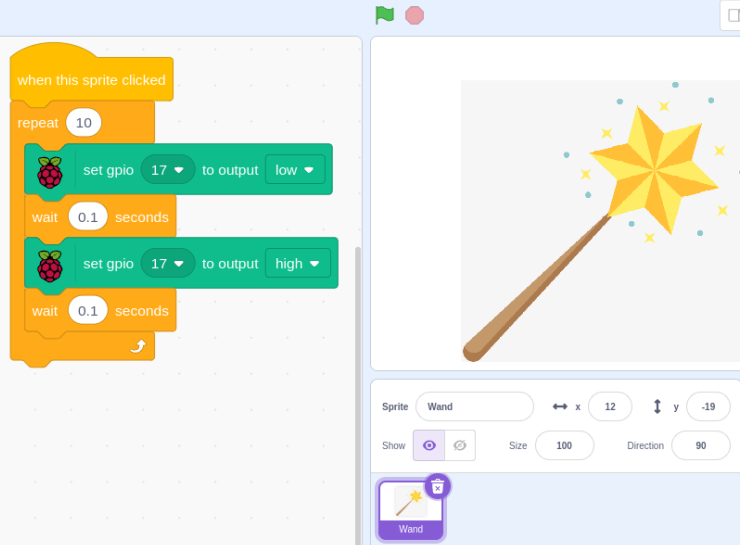

1.1 Wand
=================

Today we will use LED, Raspberry Pi and Scratch to make a fun game. When we wave the magic wand, the LED will blink.

.. image:: img/1.1_header.png

**Required Components**
------------------------------

In this project, we need the following components. 

.. image:: img/1.1_list.png

It's definitely convenient to buy a whole kit, here's the link: 

.. list-table::
    :widths: 20 20 20
    :header-rows: 1

    *   - Name	
        - ITEMS IN THIS KIT
        - LINK
    *   - Raphael Kit
        - 337
        - |link_Raphael_kit|

You can also buy them separately from the links below.

.. list-table::
    :widths: 30 20
    :header-rows: 1

    *   - COMPONENT INTRODUCTION
        - PURCHASE LINK

    *   - :ref:`GPIO Extension Board`
        - |link_gpio_board_buy|
    *   - :ref:`Breadboard`
        - |link_breadboard_buy|
    *   - :ref:`Jumper Wires`
        - |link_wires_buy|
    *   - :ref:`Resistor`
        - |link_resistor_buy|
    *   - :ref:`LED`
        - |link_led_buy|

Build the Circuit
-----------------------

.. image:: img/1.1_image49.png

Add GPIO Extension
---------------------

Click on the **Add Extension** button in the bottom left corner，then add the **Raspberry Pi GPIO**, an extension we use for all of our Scratch projects.

.. image:: img/1.1_scratchled1.png
    :align: center

.. image:: img/1.1_scratchled2.png
    :align: center

.. image:: img/1.1_scratchled3.png
    :align: center

Load the Code and See What Happens
-----------------------------------------

Load the code file from your computer(``~/raphael-kit/scratch/code``) to Scratch 3.

.. image:: img/1.1_scratch_step1.png

.. image:: img/1.1_scratch_step2.png

After clicking the magic wand in the stage area, you will see the LED will blink for two seconds.

Tips on Sprite
----------------

Click on the **Upload Sprite**.

.. image:: img/1.1_upload_sprite.png

Upload **Wand.png** from the ``~/raphael-kit/scratch/picture`` path to Scratch 3.

.. image:: img/1.1_upload.png

Finally, delete the **Sprite1**.

.. image:: img/1.1_delete.png

Tips on Codes
--------------

.. image:: img/1.1_LED1.png
  :width: 300

This is an event block whose trigger condition is to click on the green flag on the stage. A trigger event is required at the beginning of all codes, and you can select other trigger events in the **Events** category of the **block palette**.

.. image:: img/1.1_events.png
  :width: 300

For example, we can now change the trigger event to a click on the sprite.

.. image:: img/1.1_LED2.png
  :width: 300

This is a block with a set number of cycles. When we fill in the number 10, the events in the block will be executed 10 times.

.. image:: img/1.1_LED4.png
  :width: 300

This block is used to pause the program for a period of time in seconds.

.. image:: img/1.1_LED3.png
  :width: 500

Since the BCM naming method is used in Scratch, this code is setting GPIO17(BCM17) as 0V (low level). Since the cathode of LED is connected to GPIO17, thus the LED will light up. On the contrary, if you set GPIO(BCM17) as high, the LED will turn off.