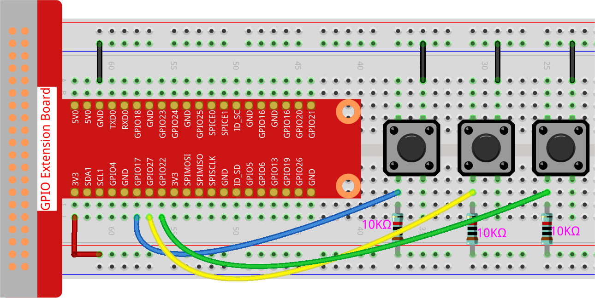

1.4 Hare
==============

Today, we will use Button, Raspberry Pi and Scratch to create a hare with various changes!

When we press the first button, the hare in the stage area will change its body color; when we press the second button, the hare will change its body size; when we press the third button, the hare will take a step forward.

.. image:: img/1.4_header.png

**Required Components**
------------------------------

In this project, we need the following components. 

.. image:: img/1.4_list.png

It's definitely convenient to buy a whole kit, here's the link: 

.. list-table::
    :widths: 20 20 20
    :header-rows: 1

    *   - Name	
        - ITEMS IN THIS KIT
        - LINK
    *   - Raphael Kit
        - 337
        - |link_Raphael_kit|

You can also buy them separately from the links below.

.. list-table::
    :widths: 30 20
    :header-rows: 1

    *   - COMPONENT INTRODUCTION
        - PURCHASE LINK

    *   - :ref:`GPIO Extension Board`
        - |link_gpio_board_buy|
    *   - :ref:`Breadboard`
        - |link_breadboard_buy|
    *   - :ref:`Jumper Wires`
        - |link_wires_buy|
    *   - :ref:`Resistor`
        - |link_resistor_buy|
    *   - :ref:`Button`
        - |link_button_buy|

Build the Circuit
---------------------

Load the Code and See What Happens
-----------------------------------------

Load the code file (``1.4_hare.sb3``) into Scratch 3.

Now you can try to press each of the 3 buttons to see how the Hare on the stage will change.

Tips on Sprite
----------------

Click the **Choose a Sprite** button in the lower right corner of the sprite area, enter **Hare** in the search box, and then click to add it.

.. image:: img/1.4_button1.png

Delete Sprite1.

.. image:: img/1.4_button2.png

Tips on Codes
--------------

.. image:: img/1.4_button3.png
  :width: 400

This is an event block that is triggered when the level of GPIO17 is high, which means that the button is pressed at that moment.

.. image:: img/1.4_button4.png
  :width: 400

This is a block to change the color of **Hare**, the range of the value is 0 ~ 199, beyond 199 will change from 0 again.

.. image:: img/1.4_button5.png
  :width: 250

This is a block used to change the size for sprite, the higher the value, the larger the sprite.

.. note::
  The sprite is also not infinitely large, and its maximum size is related to the original image size.

.. image:: img/1.4_button6.png
  :width: 200

This is a block that switches sprite costumes, and when **Hare**'s costume keeps switching, it does a series of coherent actions. For example, in this project, make **Hare** take a step forward.