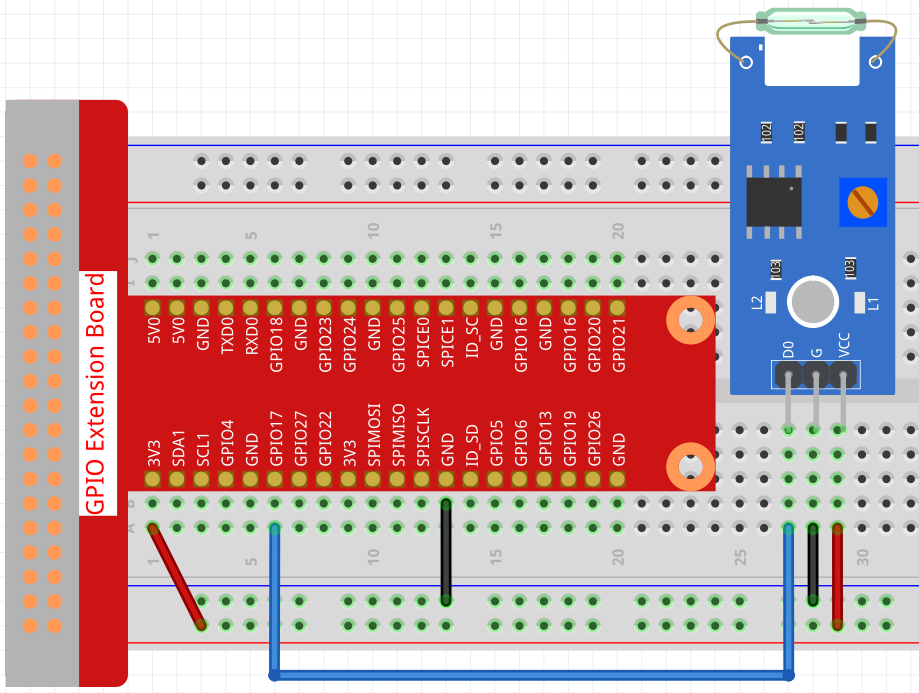

.. _1.6_scratch:

1.6 Verschwindende Vase
========================

Lassen Sie uns jetzt einen kleinen Zaubertrick vollführen: Nichts tun und plötzlich verschwindet die Vase.

.. image:: img/1.6_header.png

Benötigte Komponenten
------------------------------

Für dieses Projekt benötigen wir die folgenden Komponenten.

.. image:: img/1.6_component.png

Es ist sicherlich praktisch, ein ganzes Set zu kaufen. Hier ist der Link:

.. list-table::
    :widths: 20 20 20
    :header-rows: 1

    *   - Name
        - ARTIKEL IN DIESEM KIT
        - LINK
    *   - Raphael Kit
        - 337
        - |link_Raphael_kit|

Sie können diese auch einzeln über die untenstehenden Links erwerben.

.. list-table::
    :widths: 30 20
    :header-rows: 1

    *   - KOMPONENTENBESCHREIBUNG
        - KAUF-LINK

    *   - :ref:`gpio_extension_board`
        - |link_gpio_board_buy|
    *   - :ref:`breadboard`
        - |link_breadboard_buy|
    *   - :ref:`wires`
        - |link_wires_buy|
    *   - :ref:`reed_switch`
        - |link_reed_switch_buy|

Schaltung aufbauen
---------------------

Laden Sie den Code und sehen Sie, was passiert
---------------------------------------------------

Laden Sie die Code-Datei (``1.6_vanishing_vase.sb3``) in Scratch 3.

Wenn Sie einen Magneten in die Nähe des Reed-Schalter-Moduls bringen, erscheint eine Vase auf der Bühne. Entfernen Sie den Magneten, verschwindet die Vase.

Tipps zu Sprite
-------------------

Wählen Sie Sprite1 aus und klicken Sie in der oberen linken Ecke auf **Costumes**; laden Sie **desk1.png** und **desk2.png** über den Pfad ``~/raphael-kit/scratch/picture`` mit der Schaltfläche **Upload Costume** hoch; löschen Sie die beiden Standardkostüme und benennen Sie das Sprite in **desk** um.

.. image:: img/1.6_vase.png

Tipps zu Codes
----------------

.. image:: img/1.6_reed2.png
  :width: 400

Wenn der Magnet dem Reed-Schalter-Modul nahe ist, ist gpio17 niedrig, und das Kostüm des **desk**-Sprites wird auf **desk1** gewechselt (die Vase steht noch auf dem Tisch).

.. image:: img/1.6_reed3.png
  :width: 400

Nach dem Entfernen des Magneten ist gpio17 hoch. Zu diesem Zeitpunkt wird das Kostüm des **desk**-Sprites auf **desk2** gewechselt (nur ein Tisch).
